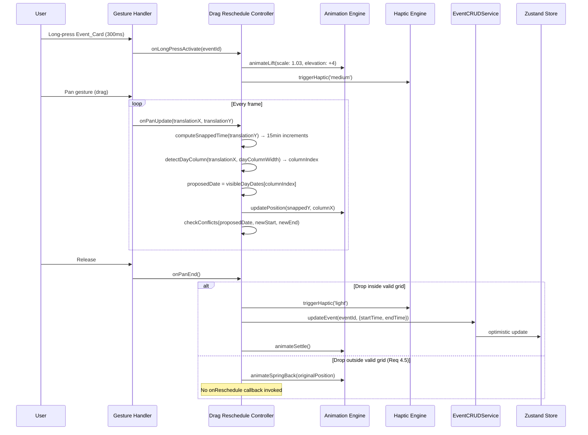
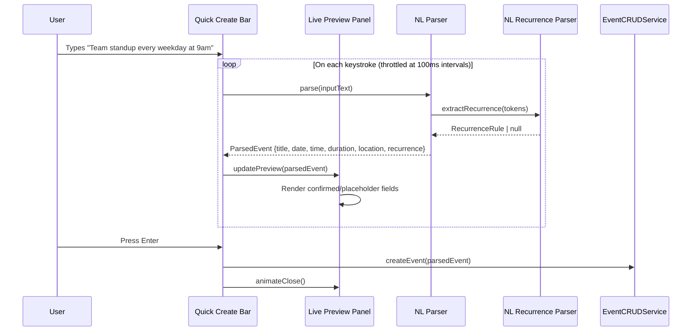
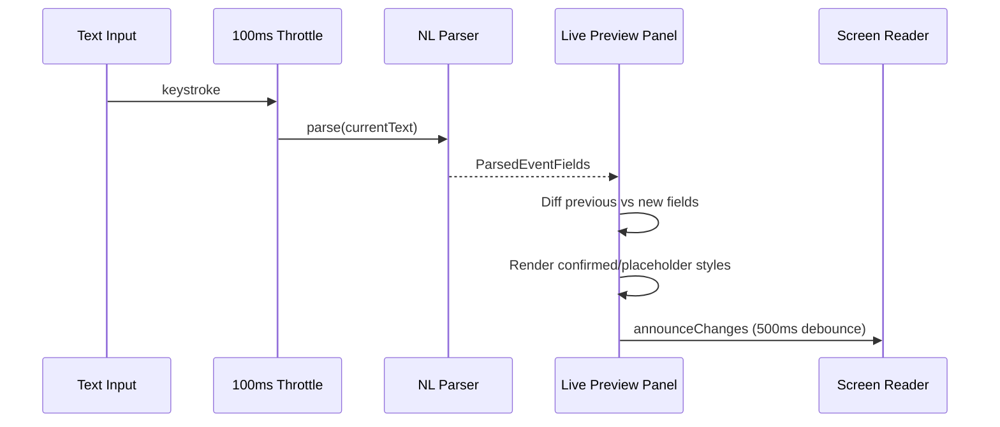

# Design Document: Competitive UI Overhaul

## Overview

This design transforms the Unified Calendar App's front-end from a static, `StyleSheet`-only UI into a fluid, gesture-driven, animation-rich experience competitive with premium calendar apps (Fantastical, Amie, Notion Calendar, Morgen). The overhaul introduces a centralized design token system, a `react-native-reanimated` animation engine, gesture-based event manipulation (drag-to-reschedule, drag-to-resize, swipe navigation), natural language event creation with live preview, recurrence expression parsing, and a polished onboarding experience — all while maintaining the existing offline-first architecture, accessibility compliance, and cross-platform support.

### Key Design Decisions

1. **Design Token System as Single Source of Truth**: All visual constants (colors, typography, spacing, radii, shadows) are centralized in a single TypeScript module. Every UI component imports tokens instead of hardcoding values. This enables dark mode, future theming, and consistent styling across 20+ new and existing components.

2. **react-native-reanimated for All Animations**: All animations run on the native UI thread via `react-native-reanimated` worklets, guaranteeing 60fps on mobile and web. A shared spring configuration module (`damping: 15, stiffness: 150`) ensures consistent motion curves app-wide. The `useReducedMotion` hook gates all animations for accessibility.

3. **react-native-gesture-handler for All Gestures**: Drag-to-reschedule, drag-to-resize, swipe navigation, and pull-to-refresh all use `react-native-gesture-handler`'s declarative gesture system. Gesture priority is managed via `simultaneousHandlers` and `waitFor` refs to prevent conflicts (e.g., swipe navigation is suppressed during drag operations).

4. **NL Parser as Pure Functions**: The natural language parser and printer are implemented as pure, stateless functions with no side effects. This makes them ideal for property-based testing (round-trip verification) and enables the 100ms live preview update target since parsing is synchronous and allocation-light.

5. **Recurrence NL Parser Layered on Top of Event NL Parser**: The recurrence expression parser is a separate module that the event NL parser delegates to when it detects recurrence keywords. This keeps the single-event parser simple and allows independent testing of recurrence round-trips.

6. **expo-haptics for Platform-Native Haptics**: Haptic feedback uses `expo-haptics` which wraps iOS `UIImpactFeedbackGenerator` and Android `VibrationEffect`. It falls back to a no-op on web. The haptic engine is a thin wrapper that checks the OS haptic setting before triggering.

7. **Incremental Integration**: New modules (animation engine, gesture controllers, NL parser) are additive — they wrap or extend existing components rather than replacing them. The existing `EventCRUDService`, `SyncEngine`, `calendarViewModel`, and Zustand stores remain unchanged. New gesture controllers call into the existing `updateEvent` flow.

### New Dependencies

| Package | Purpose | Version |
|---------|---------|---------|
| `react-native-reanimated` | UI-thread animations, shared values, worklets | ^3.x |
| `react-native-gesture-handler` | Pan, long-press, swipe gesture recognition | ^2.x |
| `expo-haptics` | Platform-native haptic feedback | ^14.x |

## Architecture

### High-Level Module Integration

```mermaid
graph TB
    subgraph Existing ["Existing Modules (Unchanged)"]
        CRUD[EventCRUDService]
        SE[SyncEngine]
        VM[calendarViewModel]
        Stores[Zustand Stores]
        A11y[Accessibility Hooks]
        OB[OnboardingManager]
        RL[ResponsiveLayout]
    end

    subgraph NewUI ["New UI Modules"]
        DTS[Design Token System]
        AE[Animation Engine]
        MIS[Micro-Interaction System]
        VTA[View Transition Animator]
        VMS[Animated ViewModeSwitcher]
    end

    subgraph Gestures ["Gesture Controllers"]
        DRC[Drag Reschedule Controller]
        DRzC[Drag Resize Controller]
        SNC[Swipe Navigation Controller]
        PTR[Pull-to-Refresh Controller]
        IEC[Inline Event Creator]
    end

    subgraph NLParsing ["Natural Language Parsing"]
        NLP[NL Parser]
        NLPr[NL Printer]
        NLRec[NL Recurrence Parser]
        NLRecPr[NL Recurrence Printer]
        QCB[Quick Create Bar]
        LPP[Live Preview Panel]
    end

    subgraph NewComponents ["New Components"]
        HFE[Haptic Feedback Engine]
        KSM[Keyboard Shortcut Manager]
        SHO[Shortcut Help Overlay]
        ESV[Empty State View]
        CS[Calendar Sidebar]
        MMN[Mini Month Navigator]
        CTI[Current Time Indicator]
        OA[Onboarding Animator]
    end

    DTS --> AE
    DTS --> MIS
    DTS --> VTA
    DTS --> VMS
    DTS --> ESV
    DTS --> CS
    DTS --> QCB
    DTS --> LPP
    DTS --> OA

    AE --> MIS
    AE --> VTA
    AE --> DRC
    AE --> DRzC
    AE --> SNC
    AE --> OA

    DRC --> CRUD
    DRzC --> CRUD
    IEC --> CRUD
    QCB --> NLP
    NLP --> NLRec
    QCB --> CRUD
    PTR --> SE

    HFE --> DRC
    HFE --> DRzC
    HFE --> QCB

    KSM --> QCB
    KSM --> VM

    CS --> VM
    CS --> Stores
    MMN --> VM

    OA --> OB
    A11y --> AE
end
```

### Data Flow: Drag-to-Reschedule



### Data Flow: Natural Language Parsing with Live Preview



### Data Flow: Live Preview Update Cycle



## Components and Interfaces

### Design Token System

```typescript
/** Req 1: Centralized design tokens replacing all hardcoded style values */

interface DesignTokens {
  colors: ColorTokens;
  typography: TypographyTokens;
  spacing: SpacingTokens;
  radii: RadiiTokens;
  shadows: ShadowTokens;
}

interface ColorTokens {
  /** 15+ distinct event colors, WCAG 2.1 AA compliant */
  eventPalette: readonly string[];  // min 15 colors
  primary: string;
  primaryLight: string;
  primaryDark: string;
  secondary: string;
  accent: string;
  background: string;
  surface: string;
  surfaceElevated: string;
  textPrimary: string;
  textSecondary: string;
  textMuted: string;
  textOnPrimary: string;
  /** Text color for content rendered on `primaryLight` backgrounds.
   *  Separate from `textOnPrimary` because white on `primaryLight`
   *  (#E5684C in light mode) only reaches ≈3:1 contrast — this token
   *  routes a near-black label that meets the 4.5:1 WCAG AA threshold. */
  textOnPrimaryLight: string;
  /** Text color for content rendered on `primaryDark` backgrounds. */
  textOnPrimaryDark: string;
  border: string;
  borderLight: string;
  error: string;
  success: string;
  warning: string;
  /** Current time indicator color */
  nowIndicator: string;
}

interface TypographyTokens {
  fontFamily: { primary: string; mono: string };
  sizes: {
    caption: number;     // ~10px
    body: number;        // ~14px
    subheading: number;  // ~16px
    heading: number;     // ~20px
    title: number;       // ~24px
    display: number;     // ~32px
  };
  lineHeights: Record<keyof TypographyTokens['sizes'], number>;
  weights: { regular: string; medium: string; semibold: string; bold: string };
}

interface SpacingTokens {
  /** 4px base unit */
  base: 4;
  xs: 4;    // 1 × base
  sm: 8;    // 2 × base
  md: 12;   // 3 × base
  lg: 16;   // 4 × base
  xl: 24;   // 6 × base
  '2xl': 32;  // 8 × base
  '3xl': 48;  // 12 × base
  '4xl': 64;  // 16 × base
}

interface RadiiTokens {
  none: 0;
  sm: 4;
  md: 8;
  lg: 16;
  full: 9999;
}

interface ShadowTokens {
  none: ShadowStyle;
  sm: ShadowStyle;
  md: ShadowStyle;
  lg: ShadowStyle;
}

interface ShadowStyle {
  shadowColor: string;
  shadowOffset: { width: number; height: number };
  shadowOpacity: number;
  shadowRadius: number;
  elevation: number;  // Android
}

/** Light and dark mode token sets */
declare const lightTokens: DesignTokens;
declare const darkTokens: DesignTokens;

/** Hook to get current tokens based on color scheme */
declare function useTokens(): DesignTokens;
```

### Animation Engine

```typescript
/** Req 2: Shared animation configuration and utilities */

interface AnimationConfig {
  /** Default spring config for all animations */
  defaultSpring: { damping: 15; stiffness: 150; mass: 1 };
  /** Timing durations (ms) */
  durations: {
    instant: 0;
    fast: 100;
    normal: 200;
    slow: 300;
    viewTransition: 350;
    entrance: 400;
  };
}

/** Shared spring config used by all animated components */
declare const SPRING_CONFIG: { damping: number; stiffness: number; mass: number };

/** Widened spring config type for callers passing partial overrides */
interface SpringConfig {
  damping: number;
  stiffness: number;
  mass: number;
}

/** Reanimated animation descriptor — see `import type { AnimatableValue } from 'react-native-reanimated'` */
type AnimatableValue = import('react-native-reanimated').AnimatableValue;

/**
 * Hook that returns animation utilities respecting reduced motion.
 * When reduced motion is active, all animations resolve instantly.
 */
interface UseAnimationReturn {
  /** Whether animations should be skipped */
  shouldAnimate: boolean;
  /** Spring config (returns instant config if reduced motion) */
  springConfig: typeof SPRING_CONFIG | { duration: 0 };
  /**
   * Drive a shared value to `toValue` using the shared spring config, or
   * instantly when reduced motion is active.
   *
   * Returns a Reanimated animation descriptor (`AnimatableValue`), NOT a
   * plain `number` — it MUST be assigned to a `SharedValue.value`.
   */
  withMotion: (
    toValue: number,
    config?: Partial<SpringConfig>
  ) => AnimatableValue;
}

declare function useAnimation(): UseAnimationReturn;
```

### View Transition Animator

```typescript
/** Req 3: Animated transitions between calendar view modes */

interface ViewTransitionAnimatorProps {
  /** Current active view mode */
  activeView: DefaultViewMode;
  /** Children render function receiving animation styles */
  children: (animatedStyle: AnimatedStyleProp) => React.ReactNode;
}

/**
 * Wraps calendar views and orchestrates crossfade + horizontal slide
 * transitions when activeView changes. Completes within 350ms.
 * Ignores additional view switch requests while a transition is in progress.
 * Skips all animations when Reduced_Motion_Mode is active.
 */
declare function ViewTransitionAnimator(props: ViewTransitionAnimatorProps): JSX.Element;

/**
 * Zoom-in transition for Month_View day tap → Day_View navigation.
 * Animates from the tapped cell's position to full-screen Day_View.
 */
interface ZoomTransitionConfig {
  originRect: { x: number; y: number; width: number; height: number };
  onComplete: () => void;
}

declare function useZoomTransition(config: ZoomTransitionConfig): {
  animatedStyle: AnimatedStyleProp;
  startTransition: () => void;
};
```

### Drag Reschedule Controller

```typescript
/** Req 4: Long-press and drag events to new time slots */

interface DragRescheduleConfig {
  /** Minimum long-press duration to activate drag (ms) */
  longPressDuration: 300;
  /** Time slot snap increment (minutes) */
  snapIncrement: 15;
  /** Maximum time to persist after drop (ms) */
  maxPersistTime: 200;
  /** Width of a single day column in pixels (for week view horizontal drag) */
  dayColumnWidth: number;
  /** Ordered array of dates for each visible day column (for week view) */
  visibleDayDates: Date[];
  /** Callback to update event times */
  onReschedule: (eventId: string, newStart: Date, newEnd: Date) => Promise<void>;
  /**
   * Callback to check conflicts at proposed time.
   *
   * Task 9.12 (Option A): `calendarAccountId` is forwarded so the
   * downstream adapter can apply account-scoped filtering if required.
   */
  onConflictCheck: (
    eventId: string,
    newStart: Date,
    newEnd: Date,
    calendarAccountId: string,
  ) => ConflictCheckResult;
}

interface ConflictCheckResult {
  hasConflict: boolean;
  conflictingEventIds: string[];
}

interface DragRescheduleState {
  isDragging: boolean;
  draggedEventId: string | null;
  /** Current vertical translation (time axis) */
  translationY: number;
  /** Current horizontal translation (day axis, week view only) */
  translationX: number;
  /** The day column index the event is currently over (0-6 in week view, always 0 in day view) */
  currentDayColumnIndex: number;
  /** The proposed new date based on horizontal position (week view cross-day drag) */
  proposedDate: Date | null;
  proposedStart: Date | null;
  proposedEnd: Date | null;
  hasConflict: boolean;
}

/**
 * Hook that provides gesture handlers and state for drag-to-reschedule.
 * Returns a composed gesture (LongPress + Pan) from react-native-gesture-handler.
 * Lift animation: scale 1.03, elevation increase.
 * Drop animation: settle to new position or spring back to original.
 * Reduced motion: border highlight only, no scale/elevation animation.
 */
declare function useDragReschedule(config: DragRescheduleConfig): {
  gesture: ComposedGesture;
  state: DragRescheduleState;
  animatedStyle: AnimatedStyleProp;
  timeIndicatorStyle: AnimatedStyleProp;
};
```

### Conflict Indicator Overlay

```typescript
/**
 * Req 4.4, 13.5: Visual indicator rendered on top of the Event_Card
 * (or the overlapping region of adjacent events) during drag-to-reschedule
 * and drag-to-resize when the proposed time range conflicts with another
 * event.
 *
 * Data source: the `hasConflict` and `conflictingEventIds` fields on the
 * gesture controller state (DragRescheduleState, DragResizeState) provide
 * the inputs. `ConflictCheckResult` is produced by an adapter that wraps
 * the existing `ConflictDetector.detectConflicts` (from
 * `src/conflicts/conflictDetector.ts`).
 */

interface ConflictIndicatorOverlayProps {
  /** Whether to render the indicator (driven by state.hasConflict) */
  visible: boolean;
  /**
   * Bounding box of the proposed event position in the view's coordinate space.
   * Used to position the overlay. Same coordinate system as the animatedStyle
   * returned by the gesture controller.
   */
  proposedRect: { x: number; y: number; width: number; height: number };
  /**
   * Overlapping region with the conflicting event(s), expressed as a vertical
   * slice of the proposed rect (startY / endY relative to proposedRect.y).
   * If omitted, the overlay covers the full proposedRect.
   */
  overlapSlice?: { startY: number; endY: number };
  /** Number of conflicting events (for accessibility announcement) */
  conflictCount: number;
}

/**
 * Behavior:
 * - Renders an absolutely-positioned overlay at `proposedRect`.
 * - If `overlapSlice` is provided, only the overlapping region is highlighted;
 *   otherwise the full rect is highlighted.
 * - Entrance animation: fade-in (100ms) when `visible` transitions false→true.
 *   Exit: fade-out (100ms). Reduced motion: instant show/hide.
 * - Does not capture touches (pointerEvents="none") so drag gestures pass
 *   through to the underlying EventCard.
 *
 * Styling:
 * - Background: `tokens.colors.warning` at 0.25 opacity.
 * - Border: 2px solid `tokens.colors.warning`.
 * - Border radius: matches EventCard (`tokens.radii.md`).
 * - Diagonal hatch pattern on web (CSS `repeating-linear-gradient`) to make
 *   the conflict visually distinct from a normal selection highlight.
 *   On native: solid warning color with 0.25 opacity (no hatch pattern
 *   since React Native has no native CSS gradient support without an
 *   additional library).
 *
 * Accessibility:
 * - role="img" with accessibilityLabel="Conflict with N existing event(s)"
 *   where N is `conflictCount`.
 * - The parent gesture controller announces conflict state transitions via
 *   `useScreenReaderAnnouncement` (polite) on first entry into conflict
 *   (not on every frame) using message:
 *   "Conflicts with N event(s)" / "No conflict".
 */
declare function ConflictIndicatorOverlay(
  props: ConflictIndicatorOverlayProps,
): JSX.Element;
```

### Conflict Check Adapter

```typescript
/**
 * Req 4.4, 13.5: Adapter that exposes the existing `ConflictDetector`
 * (from `src/conflicts/conflictDetector.ts`) in the shape required by
 * `DragRescheduleConfig.onConflictCheck` and `DragResizeConfig.onConflictCheck`.
 *
 * The existing `ConflictDetector.detectConflicts(event, allEvents)` returns
 * `Conflict[]`. The adapter:
 *
 * 1. Constructs a synthetic `CalendarEvent` from the drag's proposed start/end
 *    (carrying over the original event's id, calendarAccountId, title, etc.),
 *    so `detectConflicts` can run its existing overlap logic unmodified.
 *
 * 2. Filters out any conflict whose `conflictingEventId` matches `eventId`
 *    (the event being dragged) — a drag must not conflict with itself.
 *
 * 3. Returns the existing `ConflictCheckResult` shape:
 *      { hasConflict: conflicts.length > 0,
 *        conflictingEventIds: conflicts.map(c => c.conflictingEventId) }
 *
 * The adapter uses only the synchronous `detectConflicts` method — not
 * `detectConflictsWithTravel` — so it is safe to invoke on every frame of
 * a pan gesture without triggering network or travel-time estimation.
 *
 * Performance: O(N) in the number of events. For N > 200 events, the
 * adapter pre-indexes events by day bucket on first call and re-indexes
 * only when the `allEvents` reference changes.
 */
interface ConflictCheckAdapter {
  /** Check whether a proposed time range conflicts with any existing event */
  check(
    eventId: string,
    proposedStart: Date,
    proposedEnd: Date,
    calendarAccountId: string,
  ): ConflictCheckResult;
}

/**
 * Hook that creates a memoized ConflictCheckAdapter for the current
 * visible-events array. Returns a stable `check` function suitable for
 * passing to `useDragReschedule({ onConflictCheck })` and
 * `useDragResize({ onConflictCheck })`.
 */
declare function useConflictCheckAdapter(
  allEvents: CalendarEvent[],
): ConflictCheckAdapter;
```

### Drag Resize Controller

```typescript
/** Req 13: Drag bottom edge of event to resize duration */

interface DragResizeConfig {
  /** Bottom edge hit area height (pixels) */
  hitAreaHeight: 8;
  /** Time slot snap increment (minutes) */
  snapIncrement: 15;
  /** Minimum event duration (minutes) */
  minimumDuration: 15;
  /** Maximum time to persist after release (ms) */
  maxPersistTime: 200;
  /** Callback to update event end time */
  onResize: (eventId: string, newEnd: Date) => Promise<void>;
  /**
   * Callback to check conflicts at proposed end time.
   *
   * Task 9.12 (Option A): `calendarAccountId` is forwarded so the
   * downstream adapter can apply account-scoped filtering if required.
   */
  onConflictCheck: (
    eventId: string,
    newEnd: Date,
    calendarAccountId: string,
  ) => ConflictCheckResult;
  /**
   * Haptic feedback callback triggered at each 15-minute snap point during resize drag.
   * Integrates with the `useHaptics` hook. The hook internally calls
   * `haptics.trigger('selection')` each time the snapped end time crosses
   * a new 15-minute boundary during the drag gesture.
   * (Req 14.4)
   */
  onSnapHaptic?: () => void;
}

interface DragResizeState {
  isResizing: boolean;
  resizingEventId: string | null;
  proposedEnd: Date | null;
  hasConflict: boolean;
}

/**
 * Hook that provides gesture handlers for drag-to-resize.
 * Activates when user presses within bottom 8px of an Event_Card.
 * Snaps to 15-minute increments. Enforces minimum 15-minute duration.
 * Reduced motion: static border highlight instead of animated handle.
 *
 * Haptic integration (Req 14.4): Tracks the last snapped end time via a
 * shared value. On each pan update, if the newly snapped end time differs
 * from the previous snap, calls `config.onSnapHaptic()` which triggers
 * `haptics.trigger('selection')` — producing a haptic tick at each
 * 15-minute snap point during the resize drag.
 *
 * Usage with useHaptics:
 *   const haptics = useHaptics();
 *   const { gesture, state } = useDragResize({
 *     ...config,
 *     onSnapHaptic: () => haptics.trigger('selection'),
 *   });
 */
declare function useDragResize(config: DragResizeConfig): {
  gesture: PanGesture;
  state: DragResizeState;
  animatedStyle: AnimatedStyleProp;
  handleStyle: AnimatedStyleProp;
};
```

### Swipe Navigation Controller

```typescript
/** Req 15: Horizontal swipe to navigate forward/backward in time */

interface SwipeNavigationConfig {
  /** Minimum horizontal swipe distance (pixels) */
  minDistance: 50;
  /** Transition duration (ms) */
  transitionDuration: 300;
  /** Callback for forward navigation */
  onNavigateForward: () => void;
  /** Callback for backward navigation */
  onNavigateBack: () => void;
  /** Whether to suppress swipe (e.g., during drag operations) */
  suppressSwipe: boolean;
}

/**
 * Hook that provides a horizontal fling/pan gesture for time navigation.
 * Requires horizontal velocity > vertical velocity to distinguish from scrolling.
 * Animates current view sliding out and incoming view sliding in.
 * Reduced motion: instant view switch, no slide animation.
 */
declare function useSwipeNavigation(config: SwipeNavigationConfig): {
  gesture: PanGesture;
  animatedStyle: AnimatedStyleProp;
  incomingStyle: AnimatedStyleProp;
};
```

### Swipe Navigation Host

```typescript
/**
 * Req 15.4: Wrapper component that consumes the `animatedStyle` and
 * `incomingStyle` from `useSwipeNavigation` and renders both the current
 * view and the incoming view with a double-buffer layout so the slide
 * animation is visible.
 *
 * Without this host, Task 18.2's "integrate useSwipeNavigation into Day/
 * Week/Month views" has no way to display the incoming view mid-gesture —
 * the hook returns two animated styles but does not itself render
 * anything.
 */

interface SwipeNavigationHostProps {
  /**
   * The current view's anchor date. When this changes (e.g., after a
   * swipe commits), the host snaps the incoming view into the current
   * slot and resets the animated styles.
   */
  anchorDate: Date;

  /**
   * Render function for a calendar view at a specific anchor date.
   * Called three times per render: for the previous view, the current
   * view, and the next view. The host uses these to populate the
   * outgoing-incoming pair during a swipe.
   */
  renderView: (anchorDate: Date) => React.ReactNode;

  /** Callback invoked when a forward swipe commits */
  onNavigateForward: () => void;

  /** Callback invoked when a backward swipe commits */
  onNavigateBack: () => void;

  /** Unit of navigation (used to compute prev/next anchor dates) */
  unit: 'day' | 'week' | 'month';
}

/**
 * Behavior:
 * - Renders three absolutely-positioned view layers: previous (offset -100%),
 *   current (offset 0), next (offset +100%).
 * - Applies `animatedStyle` from `useSwipeNavigation` to the current layer
 *   and `incomingStyle` to whichever neighbor layer matches the swipe
 *   direction. Only the relevant neighbor animates; the other stays
 *   hidden via opacity: 0.
 * - On swipe commit (handled by the hook's callbacks), the host updates
 *   its internal "committed direction" state, calls `onNavigateForward`
 *   or `onNavigateBack`, and resets the animated values so the newly-
 *   committed view is now the "current" layer.
 * - Reduced motion: skips the slide animation entirely; the hook's
 *   callback fires synchronously on swipe detection and the host simply
 *   re-renders with the new anchorDate.
 *
 * Gesture integration:
 *   const { gesture, animatedStyle, incomingStyle } = useSwipeNavigation({
 *     minDistance: 50,
 *     transitionDuration: 300,
 *     onNavigateForward: host.handleForward,
 *     onNavigateBack: host.handleBack,
 *     suppressSwipe: useGestureContext().isDragActive,
 *   });
 *   <GestureDetector gesture={gesture}>
 *     <SwipeNavigationHost ... />
 *   </GestureDetector>
 *
 * Usage at call site (e.g., DayView wrapper):
 *   <SwipeNavigationHost
 *     anchorDate={currentDate}
 *     unit="day"
 *     onNavigateForward={() => setCurrentDate(addDays(currentDate, 1))}
 *     onNavigateBack={() => setCurrentDate(addDays(currentDate, -1))}
 *     renderView={(d) => <DayView date={d} events={eventsForDay(d)} ... />}
 *   />
 *
 * Accessibility:
 * - The outgoing and incoming views both remain in the accessibility tree
 *   during the transition. After commit, the outgoing view is unmounted
 *   once the slide animation completes so screen readers see only the
 *   final view.
 */
declare function SwipeNavigationHost(
  props: SwipeNavigationHostProps,
): JSX.Element;
```

### Natural Language Parser

```typescript
/** Req 5: Parse natural language event descriptions into structured fields */

/**
 * Three-state recurrence parsing outcome (Req 17.8).
 *
 * - 'none': No recurrence keyword was detected in the input. `recurrence` is null.
 * - 'parsed': A recurrence keyword was detected AND the frequency was
 *   successfully determined. `recurrence` is a non-null RecurrenceRule.
 * - 'attempted_unresolved': A recurrence keyword was detected (e.g., "every",
 *   "weekly", "monthly", "each", "repeats") BUT the frequency could not be
 *   determined (e.g., "every blorp", "repeats sometimes"). `recurrence` is null.
 *   The Quick_Create_Bar uses this state to trigger the EventEditor fallback
 *   with the recurrence section highlighted.
 */
type RecurrenceParseState = 'none' | 'parsed' | 'attempted_unresolved';

interface ParsedEvent {
  title: string;
  date: Date | null;
  time: { hours: number; minutes: number } | null;
  duration: number;  // minutes, default 60
  location: string | null;
  attendees: string[];
  recurrence: RecurrenceRule | null;
  /** Fields that were successfully extracted vs defaulted */
  confidence: {
    date: boolean;
    time: boolean;
    duration: boolean;
    location: boolean;
    /**
     * Three-state recurrence outcome. Replaces the previous boolean so that
     * "no recurrence attempted" can be distinguished from "attempted but
     * frequency unresolved" — the latter triggers the EventEditor fallback
     * per Req 17.8.
     */
    recurrence: RecurrenceParseState;
  };
}

/**
 * Pure function. Parses a natural language string into structured event fields.
 *
 * Supported date references: "today", "tomorrow", "next Monday"–"next Sunday",
 * "January 15", "in 3 days", etc.
 *
 * Supported time expressions: "at noon", "at 3pm", "at 15:00",
 * "morning" (9:00), "afternoon" (14:00), "evening" (18:00).
 *
 * Supported durations: "for 30 minutes", "for 1 hour", "for 2 hours",
 * "for 1.5 hours". Default: 60 minutes.
 *
 * Location: extracted from "at <location>" after time expression.
 * Attendees: extracted from "with <name>" phrases.
 * Recurrence: delegates to parseRecurrence() when recurrence keywords detected.
 */
declare function parseNaturalLanguage(
  input: string,
  referenceDate?: Date
): ParsedEvent;

/**
 * Pure function. Converts a structured CalendarEvent back into a
 * human-readable natural language string.
 *
 * Round-trip property: for all valid NL inputs that parse successfully,
 * parseNaturalLanguage(printEvent(parsedEvent)) produces an equivalent ParsedEvent.
 */
declare function printEvent(event: ParsedEvent): string;
```

### Recurrence NL Parser

```typescript
/** Req 17: Parse recurrence expressions into RFC 5545 RRULEs */

/**
 * Pure function. Parses a recurrence expression string into an RRULE.
 *
 * Supported patterns:
 * - "every day" → FREQ=DAILY
 * - "every weekday" → FREQ=WEEKLY;BYDAY=MO,TU,WE,TH,FR
 * - "every week" → FREQ=WEEKLY
 * - "every 2 weeks" → FREQ=WEEKLY;INTERVAL=2
 * - "every month" → FREQ=MONTHLY
 * - "every year" → FREQ=YEARLY
 * - "every Monday" → FREQ=WEEKLY;BYDAY=MO
 * - "every Tuesday and Thursday" → FREQ=WEEKLY;BYDAY=TU,TH
 * - "every N days/weeks/months" → FREQ with INTERVAL=N
 * - "every first Monday of the month" → FREQ=MONTHLY;BYDAY=1MO
 * - "every last Friday" → FREQ=MONTHLY;BYDAY=-1FR
 */
declare function parseRecurrence(input: string): RecurrenceRule | null;

/**
 * Pure function. Converts an RRULE back into a human-readable string.
 *
 * Round-trip property: for all valid recurrence expressions that parse
 * successfully, parseRecurrence(printRecurrence(rule)) produces an
 * equivalent RecurrenceRule.
 */
declare function printRecurrence(rule: RecurrenceRule): string;
```

### Quick Create Bar

```typescript
/** Req 5, 18: Persistent NL input with live preview */

interface QuickCreateBarProps {
  /** Reference date for relative date parsing (defaults to today) */
  referenceDate?: Date;
  /** Callback when event is successfully created */
  onEventCreated: (event: ParsedEvent) => void;
  /** Callback when parser can't determine required fields → open editor */
  onOpenEditor: (partialEvent: Partial<ParsedEvent>) => void;
  /** Whether the bar is focused (for keyboard shortcut integration) */
  isFocused?: boolean;
  onFocus?: () => void;
  onBlur?: () => void;
}

/**
 * Persistent text input at the top of Day, Week, and Agenda views.
 * Parses input via NL_Parser on each keystroke (throttled at 100ms intervals).
 * Shows Live_Preview_Panel below when input is non-empty.
 * On submit: creates event if date+time resolved, else opens EventEditor.
 * Triggers haptic feedback on successful creation (mobile).
 */
declare function QuickCreateBar(props: QuickCreateBarProps): JSX.Element;
```

### EventEditor Pre-Population Extension

```typescript
/**
 * Req 5.8, 17.8: Extension of the existing EventEditor to accept
 * pre-populated partial fields from the Quick_Create_Bar fallback flow.
 *
 * The existing `EventEditorProps` in `src/ui/editor/EventEditor.tsx` accepts
 * only `mode` and an optional full `CalendarEvent`. This extension adds two
 * optional props so that a `Partial<ParsedEvent>` can pre-fill the form
 * without requiring a fully constructed CalendarEvent.
 */

interface EventEditorPrepopulateExtension {
  /**
   * Partial form data to seed the editor in 'create' mode.
   *
   * Populated from `ParsedEvent` fields that the NL_Parser successfully
   * extracted (title, date, time, duration, location, attendees, recurrence).
   * Fields not provided use the defaults from `createDefaultForm`.
   *
   * Only consulted when `mode === 'create'`. Ignored in 'edit' mode.
   */
  initialValues?: Partial<EventFormData>;

  /**
   * When true, visually highlights the recurrence section of the editor
   * (border + subtle pulse animation on first render) and scrolls it into
   * view. Used when the NL_Parser detected a recurrence expression but
   * could not determine the frequency (Req 17.8).
   *
   * Highlight animation: 400ms border color transition from
   * `tokens.colors.warning` to `tokens.colors.border` (reduced motion:
   * static border). Scrolls the recurrence section into view via ref on
   * mount.
   */
  highlightRecurrenceSection?: boolean;
}

/**
 * Updated EventEditorProps combining the existing props with the
 * pre-population extension.
 */
interface EventEditorProps extends EventEditorPrepopulateExtension {
  mode: 'create' | 'edit';
  event?: CalendarEvent;
  accounts: CalendarAccount[];
  existingEvents: CalendarEvent[];
  occurrenceDate?: Date;
  onSave: (eventData: Partial<CalendarEvent>) => void;
  onDelete?: (eventId: string, deleteAll: boolean) => void;
  onCancel: () => void;
}

/**
 * ParsedEvent → EventFormData mapping used by Quick_Create_Bar when opening
 * the editor in fallback mode. Implemented as a pure function next to
 * `convertParsedEventToCreateInput`.
 *
 * Mapping:
 * - title → form.title
 * - date + time → form.startTime (combined; falls back to default if either null)
 * - date + time + duration → form.endTime
 * - location → form.location
 * - attendees → form.attendees (mapped via same Attendee shape as the
 *   create converter)
 * - recurrence (when confidence.recurrence === 'parsed') → form.recurrenceRule
 *
 * Returns an object suitable to pass as `initialValues` to EventEditor.
 */
declare function parsedEventToFormData(
  parsed: Partial<ParsedEvent>,
): Partial<EventFormData>;
```

### QuickCreateBar → EventEditor Fallback Flow

```
QuickCreateBar.onSubmit()
  └─ NL_Parser.parseNaturalLanguage(input)
     ├─ confidence.date === true AND confidence.time === true
     │   AND confidence.recurrence !== 'attempted_unresolved'
     │   → convertParsedEventToCreateInput + EventCRUDService.createEvent
     │
     ├─ confidence.date === false OR confidence.time === false (Req 5.8)
     │   → onOpenEditor({
     │       initialValues: parsedEventToFormData(parsedEvent),
     │       highlightRecurrenceSection: false,
     │     })
     │
     └─ confidence.recurrence === 'attempted_unresolved' (Req 17.8)
         → onOpenEditor({
             initialValues: parsedEventToFormData(parsedEvent),
             highlightRecurrenceSection: true,
           })
```

### Live Preview Panel

```typescript
/** Req 18: Real-time preview of parsed event fields */

interface LivePreviewPanelProps {
  /** Current parsed event from NL_Parser */
  parsedEvent: ParsedEvent | null;
  /** Whether the panel is visible */
  visible: boolean;
}

/**
 * Displays parsed fields below the Quick Create Bar.
 * Updates within 100ms of each keystroke (throttled — fires immediately
 * on first keystroke, then at most once per 100ms during continuous typing).
 * Confirmed fields: solid text, primary color.
 * Unresolved fields: placeholder text, muted color.
 * Hidden when input is empty.
 * Collapse animation on submit (200ms).
 * Screen reader: ARIA live region with 500ms debounce (separate from the
 * throttled preview updates — debounce is correct here to avoid excessive
 * screen reader announcements during rapid typing).
 */
declare function LivePreviewPanel(props: LivePreviewPanelProps): JSX.Element;
```

### Haptic Feedback Engine

```typescript
/** Req 14: Platform-native haptic feedback */

type HapticPattern = 'light' | 'medium' | 'heavy' | 'selection' | 'success';

interface HapticFeedbackEngine {
  /** Trigger a haptic pattern. No-op on web or when OS haptics disabled. */
  trigger(pattern: HapticPattern): void;
  /** Whether haptics are available on this platform */
  readonly isAvailable: boolean;
}

/**
 * Uses expo-haptics internally.
 * Maps patterns to:
 * - light → ImpactFeedbackStyle.Light
 * - medium → ImpactFeedbackStyle.Medium
 * - heavy → ImpactFeedbackStyle.Heavy
 * - selection → SelectionFeedback
 * - success → Two sequential ImpactFeedbackStyle.Light triggers with a
 *   100ms gap between them (custom implementation to match Req 14.3's
 *   "two short light pulses" description). Implementation:
 *     async trigger('success') {
 *       await Haptics.impactAsync(ImpactFeedbackStyle.Light);
 *       await new Promise(resolve => setTimeout(resolve, 100));
 *       await Haptics.impactAsync(ImpactFeedbackStyle.Light);
 *     }
 *   Note: NotificationFeedbackType.Success produces a single notification
 *   vibration on iOS, which does not match the requirement's "two short
 *   light pulses" pattern. The dual-impact approach produces two distinct
 *   tactile taps that users perceive as a confirmation pattern.
 */
declare function createHapticEngine(): HapticFeedbackEngine;

/** React hook for haptic feedback */
declare function useHaptics(): HapticFeedbackEngine;
```

### Keyboard Shortcut Manager

```typescript
/** Req 11: Keyboard shortcuts for web/desktop */

interface ShortcutDefinition {
  key: string;
  modifiers?: ('ctrl' | 'shift' | 'alt' | 'meta')[];
  action: () => void;
  label: string;
  category: 'navigation' | 'creation' | 'view-switching';
}

interface KeyboardShortcutManager {
  /** Register a shortcut */
  register(shortcut: ShortcutDefinition): void;
  /** Unregister a shortcut */
  unregister(key: string): void;
  /** Get all registered shortcuts grouped by category */
  getShortcuts(): Record<string, ShortcutDefinition[]>;
  /** Whether shortcuts are currently suppressed (text input focused) */
  isSuppressed: boolean;
  /** Suppress/unsuppress shortcuts */
  setSuppressed(suppressed: boolean): void;
}

/**
 * Default shortcuts:
 * - C: Open Quick Create Bar
 * - T: Navigate to today
 * - 1/2/3/4: Switch to Day/Week/Month/Agenda view
 * - ←/→: Navigate backward/forward one unit
 * - ?: Show Shortcut Help Overlay
 * - Escape: Dismiss overlay
 *
 * Suppressed when any text input has focus.
 *
 * ARIA Live Region Announcements (Req 11.8):
 * Integrates with the existing `useScreenReaderAnnouncement` hook from
 * `src/ui/accessibility/useAccessibility.ts`. After each shortcut action
 * executes, the manager calls `announce(message, 'polite')` with the
 * following messages:
 * - C: "Quick create opened"
 * - T: "Navigated to today"
 * - 1: "Switched to day view"
 * - 2: "Switched to week view"
 * - 3: "Switched to month view"
 * - 4: "Switched to agenda view"
 * - ←: "Navigated backward"
 * - →: "Navigated forward"
 * - ?: "Shortcut help overlay opened"
 * - Escape: "Shortcut help overlay dismissed"
 *
 * Implementation: The hook internally calls `useScreenReaderAnnouncement()`
 * and wraps each config callback to announce after invocation:
 *   const { announce } = useScreenReaderAnnouncement();
 *   // In keydown handler, after calling config.onNavigateToday():
 *   announce('Navigated to today', 'polite');
 */
declare function useKeyboardShortcuts(config: {
  onOpenQuickCreate: () => void;
  onNavigateToday: () => void;
  onSwitchView: (mode: DefaultViewMode) => void;
  onNavigateBack: () => void;
  onNavigateForward: () => void;
  onShowHelp: () => void;
}): KeyboardShortcutManager;
```

### Shortcut Help Overlay

```typescript
/** Req 11.5, 11.6: Modal overlay listing all keyboard shortcuts grouped by category */

interface ShortcutHelpOverlayProps {
  /** Whether the overlay is visible */
  visible: boolean;
  /** All registered shortcuts grouped by category */
  shortcuts: Record<'navigation' | 'creation' | 'view-switching', ShortcutDefinition[]>;
  /** Callback to dismiss the overlay (triggered by Escape key or backdrop press) */
  onDismiss: () => void;
}

/**
 * Modal overlay that displays all available keyboard shortcuts grouped by category.
 * Triggered by pressing `?` key via the Keyboard_Shortcut_Manager.
 *
 * Behavior:
 * - Renders as a centered modal with a semi-transparent backdrop.
 * - Groups shortcuts into sections: Navigation, Creation, View Switching.
 * - Each shortcut displays the key combination and its label.
 * - Pressing Escape or clicking the backdrop calls onDismiss.
 * - Focus is trapped within the overlay while visible (uses useFocusTrap from useAccessibility.ts).
 * - Entrance animation: fade-in + scale-up from 0.95 to 1.0 (200ms).
 * - Exit animation: fade-out + scale-down (150ms).
 * - Reduced motion: instant show/hide, no scale animation.
 *
 * Styling:
 * - Background: tokens.colors.surface with tokens.shadows.lg elevation.
 * - Border radius: tokens.radii.lg.
 * - Padding: tokens.spacing.xl.
 * - Category headers: tokens.typography.sizes.subheading, tokens.typography.weights.semibold.
 * - Shortcut key badges: tokens.colors.surfaceElevated background, tokens.radii.sm,
 *   tokens.typography.fontFamily.mono, tokens.typography.sizes.body.
 * - Shortcut labels: tokens.typography.sizes.body, tokens.colors.textPrimary.
 * - Backdrop: rgba(0, 0, 0, 0.4).
 *
 * Accessibility:
 * - role="dialog", aria-modal="true", aria-label="Keyboard shortcuts".
 * - Close button with aria-label="Close shortcuts overlay".
 * - Each category section uses role="group" with aria-label for the category name.
 */
declare function ShortcutHelpOverlay(props: ShortcutHelpOverlayProps): JSX.Element;
```

### Inline Event Creator

```typescript
/** Req 12: Click-to-create on empty time slots */

interface InlineEventCreatorConfig {
  /** Snap increment for time selection (minutes) */
  snapIncrement: 15;
  /** Minimum event duration for single click (minutes) */
  minimumDuration: 15;
  /** Callback to create event */
  onCreate: (start: Date, end: Date, title: string) => Promise<void>;
}

interface InlineCreatorState {
  isSelecting: boolean;
  isPopoverVisible: boolean;
  selectedStart: Date | null;
  selectedEnd: Date | null;
}

/**
 * Hook for click-to-create and click-drag-to-select on Day/Week views.
 * Single click: creates 15-min event at clicked slot.
 * Click+drag: creates event spanning drag range.
 * Shows highlighted overlay during drag.
 * Shows inline popover with title input on release.
 * Enter: create event. Escape/click-outside: dismiss.
 */
declare function useInlineEventCreator(config: InlineEventCreatorConfig): {
  state: InlineCreatorState;
  onSlotPress: (date: Date, y: number) => void;
  onSlotDragStart: (date: Date, y: number) => void;
  onSlotDragMove: (y: number) => void;
  onSlotDragEnd: () => void;
  onPopoverSubmit: (title: string) => void;
  onPopoverDismiss: () => void;
  overlayStyle: AnimatedStyleProp;
};
```

### Inline Event Popover

```typescript
/** Req 12.4: Inline event creation popover at selected time range */

interface InlineEventPopoverProps {
  /** Whether the popover is visible */
  visible: boolean;
  /** Pixel position for popover placement (relative to the time grid container) */
  position: { x: number; y: number };
  /** The selected time range for the new event */
  selectedTimeRange: {
    start: Date;
    end: Date;
  };
  /** Callback when the user submits the title (Enter key or confirm button) */
  onSubmit: (title: string) => void;
  /** Callback when the user dismisses the popover (Escape key or click outside) */
  onDismiss: () => void;
}

/**
 * Compact popover displayed at the selected time range after a click-to-create
 * or click-drag-to-select gesture in Day_View or Week_View.
 *
 * Behavior:
 * - Appears at the `position` coordinates, anchored to the top of the selected range.
 * - Contains a single text input for the event title, auto-focused on mount.
 * - Displays the formatted start–end time range as a subtitle (read-only).
 * - Enter key: calls onSubmit with the current title value.
 * - Escape key: calls onDismiss.
 * - Clicking outside the popover: calls onDismiss.
 * - If title is empty on submit, uses "New Event" as the default title.
 * - Entrance animation: fade-in + slide-down from 4px above (150ms).
 * - Exit animation: fade-out (100ms).
 * - Reduced motion: instant show/hide.
 *
 * Styling:
 * - Background: tokens.colors.surface.
 * - Border: 1px solid tokens.colors.border.
 * - Border radius: tokens.radii.md.
 * - Shadow: tokens.shadows.md.
 * - Padding: tokens.spacing.sm horizontal, tokens.spacing.xs vertical.
 * - Title input: tokens.typography.sizes.body, tokens.colors.textPrimary,
 *   no visible border (borderless input style), placeholder "New Event".
 * - Time range subtitle: tokens.typography.sizes.caption, tokens.colors.textSecondary.
 * - Confirm button: small icon button with checkmark, tokens.colors.primary.
 *
 * Accessibility:
 * - role="dialog", aria-label="Create event".
 * - Title input: aria-label="Event title".
 * - Focus trapped within popover while visible (uses useFocusTrap).
 */
declare function InlineEventPopover(props: InlineEventPopoverProps): JSX.Element;
```

### Current Time Indicator

```typescript
/** Req 10: "Now" line on day and week views */

interface CurrentTimeIndicatorProps {
  /** Hour height in pixels (for position calculation) */
  hourHeight: number;
  /** Whether this is the current day column (for week view) */
  isCurrentDay: boolean;
}

/**
 * Horizontal line at current time position.
 * Styled with Design_Token_System primary accent color.
 * Small circular dot at left edge.
 * Updates position every 60 seconds via setInterval (no full re-render).
 * Only visible when isCurrentDay is true.
 */
declare function CurrentTimeIndicator(props: CurrentTimeIndicatorProps): JSX.Element;
```

### Empty State View

```typescript
/** Req 16: Contextual empty states */

type EmptyStateContext = 'day' | 'week' | 'agenda' | 'no-accounts';

interface EmptyStateViewProps {
  context: EmptyStateContext;
  onCreateEvent: () => void;
  onConnectAccount?: () => void;
}

/**
 * Displays contextual illustration, message, and CTA when no events visible.
 * Messages:
 * - day: "No events today — enjoy your free time!"
 * - week: "Your week is wide open"
 * - agenda: "Nothing coming up"
 * - no-accounts: Welcome message + "Connect Account" button
 *
 * Entrance animation: fade-in + slide-up (400ms). Static when reduced motion.
 * Illustration: decorative (empty alt text). CTA and message: labeled for SR.
 */
declare function EmptyStateView(props: EmptyStateViewProps): JSX.Element;
```

### Calendar Sidebar

```typescript
/** Req 19: Sidebar with mini month, account toggles, upcoming events */

interface CalendarSidebarProps {
  /** Current anchor date for the main calendar view */
  anchorDate: Date;
  /** Callback to update the main view's anchor date */
  onDateSelect: (date: Date) => void;
  /** All connected calendar accounts */
  accounts: CalendarAccount[];
  /** Set of hidden account IDs */
  hiddenAccountIds: ReadonlySet<string>;
  /** Toggle account visibility */
  onToggleAccount: (accountId: string) => void;
  /** Upcoming events (next 10, sorted by start time) */
  upcomingEvents: CalendarEvent[];
  /** Callback when an upcoming event is pressed */
  onEventPress: (event: CalendarEvent) => void;
}

/**
 * Left panel on tablet/desktop breakpoints.
 * Three sections: Mini_Month_Navigator, account toggles, upcoming events.
 * Mini month: compact grid, selected date highlighted, arrow navigation
 * with crossfade (200ms, instant when reduced motion).
 * Account toggles: checkbox + account name + color dot.
 * Upcoming: next 10 events with title, time, color indicator.
 * Fully keyboard-navigable (Tab between sections, Enter/Space to activate).
 */
declare function CalendarSidebar(props: CalendarSidebarProps): JSX.Element;
```

### Onboarding Animator

```typescript
/** Req 20: Animated first-run experience */

interface OnboardingAnimatorProps {
  /** Callback when onboarding completes or is skipped */
  onComplete: () => void;
  /** Callback to persist completion state */
  onPersistCompletion: () => void;
}

interface OnboardingScreen {
  id: string;
  title: string;
  description: string;
  /** Reanimated worklet-based animation component (3-6 second loop) */
  animation: AnimationAsset;
  /** Static illustration fallback for reduced motion */
  staticImage: ImageSource;
}

/**
 * Animation asset for onboarding screens (Req 20.3).
 *
 * Animations use `react-native-reanimated` worklet-based shared values
 * and `withRepeat` — NOT Lottie — to avoid an additional dependency.
 * Each animation is a React component that renders a looping demonstration
 * using `useSharedValue`, `useAnimatedStyle`, `withRepeat`, `withSequence`,
 * and `withTiming`/`withSpring`.
 *
 * The `loopDurationMs` field specifies the total loop duration (3000–6000ms).
 * The component receives `isPlaying: boolean` to start/stop the loop.
 */
interface AnimationAsset {
  /** The React component that renders the looping animation */
  component: React.ComponentType<{ isPlaying: boolean }>;
  /** Duration of one animation loop in milliseconds (3000–6000) */
  loopDurationMs: number;
}

/**
 * Static image source for reduced motion fallback.
 * Uses React Native's standard ImageSourcePropType.
 */
type ImageSource = import('react-native').ImageSourcePropType;

/**
 * Presents 3-5 animated screens showcasing key features:
 * 1. Natural language event creation
 * 2. Drag-to-reschedule
 * 3. View switching with transitions
 * (+ optional: swipe navigation, calendar sidebar)
 *
 * Progress indicator (dots). Next/Skip buttons.
 * Horizontal slide transition between screens (300ms).
 * Reduced motion: static illustrations, instant transitions.
 * Screen reader: descriptive alt text for animations, labeled controls.
 * Persists completion state via OnboardingManager.
 */
declare function OnboardingAnimator(props: OnboardingAnimatorProps): JSX.Element;
```

### Micro-Interaction System

Each micro-interaction is exposed as its own top-level hook that owns its
shared values and returns an `AnimatedStyle<ViewStyle>`. Consumers that need
a single animation should import the specific flat hook — this is the
recommended API. `useMicroInteractions()` is preserved as a convenience
aggregator for call sites that need several animations at once.

**Motion curves (Req 2.6, Key Decision #2):**

Four interactions use `withSpring(target, SPRING_CONFIG)` because their
"done" state is a visual rest position, not a deadline:
`eventCreated`, `pressDown`, `pressRelease`, `eventDeleted`.

Three interactions use `withTiming` with a specific duration because their
Acceptance Criteria require a precise completion time:
`visibilityToggle` (200ms), `syncAppear` (300ms), `pullToRefresh` (linear rotation).

All animations resolve instantly (`withTiming(…, { duration: 0 })`) when
reduced motion is active (Req 2.5, 7.5).

```typescript
/** Req 2, 7, 9: Individual micro-interaction hooks */

type VisibilityTransitionDirection = 'fading-in' | 'fading-out';

/** Event creation confirmation: scale 0.92→1.0 + fade-in (spring) */
declare function useEventCreatedStyle(active: boolean): AnimatedStyle<ViewStyle>;

/** Calendar toggle: fade-out/fade-in (200ms timing) */
declare function useVisibilityToggleStyle(
  direction: VisibilityTransitionDirection | 'idle',
): AnimatedStyle<ViewStyle>;

/** Press down: scale to 0.97 (spring) */
declare function usePressDownStyle(active: boolean): AnimatedStyle<ViewStyle>;

/** Press release: spring back to 1.0 (spring) */
declare function usePressReleaseStyle(active: boolean): AnimatedStyle<ViewStyle>;

/** Delete: shrink (scale 1→0.8) + fade-out (spring) */
declare function useEventDeletedStyle(active: boolean): AnimatedStyle<ViewStyle>;

/** Sync event: slide-in-from-right + fade-in (300ms timing) */
declare function useSyncAppearStyle(active: boolean): AnimatedStyle<ViewStyle>;

/** Pull-to-refresh: rotating indicator (linear timing) */
declare function usePullToRefreshStyle(isSpinning: boolean): AnimatedStyle<ViewStyle>;

/** Convenience aggregator — calls all seven hooks and returns them as fields. */
interface MicroInteractions {
  eventCreated: typeof useEventCreatedStyle;
  visibilityToggle: typeof useVisibilityToggleStyle;
  pressDown: typeof usePressDownStyle;
  pressRelease: typeof usePressReleaseStyle;
  eventDeleted: typeof useEventDeletedStyle;
  syncAppear: typeof useSyncAppearStyle;
  pullToRefresh: typeof usePullToRefreshStyle;
}

/**
 * Convenience aggregator exposing all seven flat hooks as object fields.
 * Each field is a direct reference to its flat hook — the consumer's
 * invocation is itself the hook call, so the Rules of Hooks are honored
 * as long as the consumer does not call a field conditionally.
 *
 * Consumers that need exactly one animation should prefer the flat hook
 * directly (e.g. `useEventCreatedStyle`) since it is cheaper and harder
 * to misuse.
 */
declare function useMicroInteractions(): MicroInteractions;
```

### Micro-Interaction Trigger Mechanisms

The `MicroInteractions` hook exposes animation primitives, but each animation
needs a trigger signal so that the right animation runs on the right Event_Card
at the right time. This section specifies those triggers.

#### syncAppear trigger (Req 7.4)

```typescript
/**
 * "Recently arrived from sync" tracking.
 *
 * The events Zustand store (`src/stores/eventsStore.ts`) has an `addEvents`
 * action called by the sync engine when new events arrive during a pull
 * operation. To distinguish sync-added events from user-created events
 * (which also use `addEvent`), we add a transient "recentlyArrivedFromSync"
 * set.
 */

interface RecentlyArrivedTracking {
  /** Set of event IDs that arrived from a sync operation within the last 1 second */
  recentlyArrivedFromSync: ReadonlySet<string>;
  /**
   * Called by the sync engine after inserting a batch of remote events.
   * Adds each id to the set; schedules removal after 1000ms via setTimeout
   * so the set does not grow unbounded.
   * This is a new action on `eventsStore`.
   */
  markArrivedFromSync: (ids: string[]) => void;
}

/**
 * Usage in EventCard:
 *   const isSyncArrival = useEventsStore(
 *     (s) => s.recentlyArrivedFromSync.has(event.id),
 *   );
 *   const { syncAppear } = useMicroInteractions();
 *   const style = isSyncArrival ? syncAppear : undefined;
 *
 * The TanStack Query layer (`src/query/useEvents.ts`) is the wiring point:
 * after `store.addEvents(events)`, it computes the delta set of truly new
 * event IDs (not present in the store snapshot captured before `addEvents`)
 * and calls `markArrivedFromSync(newIds)`. The call is suppressed on the
 * initial query settlement after app cold start so that cached/first-load
 * events do not trigger the animation. The SyncEngine (`src/sync/`) is NOT
 * modified — it writes to SQLite, not to eventsStore directly.
 */
```

#### visibilityToggle trigger (Req 2.3)

```typescript
/**
 * The existing `UnifiedCalendarView` manages `hiddenAccountIds` via
 * `toggleAccountVisibility`. When an account's visibility flips, every
 * EventCard belonging to that account needs to fade-in or fade-out.
 *
 * Trigger mechanism: each EventCard reads its own account's visibility
 * flip-edge via a hook that tracks the previous value.
 */

/**
 * Returns a "justToggledVisible" / "justToggledHidden" transient flag
 * for the given accountId. The flag is true for 200ms after the account's
 * visibility changes, then resets to false. EventCards use the flag to
 * trigger the `visibilityToggle` animation.
 */
declare function useAccountVisibilityTransition(
  accountId: string,
): 'idle' | 'fading-in' | 'fading-out';

/**
 * Usage in EventCard:
 *   const transition = useAccountVisibilityTransition(event.calendarAccountId);
 *   const { visibilityToggle } = useMicroInteractions();
 *   const style = transition === 'idle' ? undefined : visibilityToggle(transition);
 *
 * Implementation: the hook subscribes to `hiddenAccountIds` via a selector,
 * stores the previous value in a ref, detects the flip edge, and sets a
 * transient state that auto-clears after 200ms via setTimeout.
 *
 * When reduced motion is active, the hook returns 'idle' and the EventCard
 * re-renders without the account — no fade animation needed.
 */
```

#### eventDeleted trigger (Req 7.3)

```typescript
/**
 * Delete animation needs to play BEFORE the event is removed from the
 * store, otherwise the EventCard unmounts instantly with no animation.
 *
 * Note on the existing behavior: `EventCRUDService.deleteEvent` already
 * calls `eventsStore.removeEvent(eventId)` internally for UI immediacy
 * (verified in `src/events/eventCRUDService.ts`). This means we cannot
 * rely on `syncStatus === 'pending_delete'` persisting in the store as
 * the animation trigger — the store entry is gone as soon as delete is
 * called. Instead, we use a transient tracking set, mirroring the
 * `recentlyArrivedFromSync` pattern.
 *
 * Mechanism: the events store gains a `pendingAnimatedDelete: Set<string>`
 * field. The `useAnimatedEventDelete` hook adds an id to the set BEFORE
 * calling the CRUD service, waits for the animation duration, then calls
 * `EventCRUDService.deleteEvent` which removes the event from the store
 * (and by extension unmounts the EventCard after the animation has
 * completed).
 */

interface PendingAnimatedDeleteTracking {
  /** Set of event IDs currently playing the delete animation */
  pendingAnimatedDelete: ReadonlySet<string>;
  /** Mark an event as about to be deleted (starts the animation) */
  markPendingAnimatedDelete: (eventId: string) => void;
  /** Clear the pending state (used on delete failure to revert) */
  clearPendingAnimatedDelete: (eventId: string) => void;
}

/**
 * Hook that gates actual deletion behind the shrink+fade animation.
 * Returns a `deleteWithAnimation(eventId)` function that:
 *   1. Calls `markPendingAnimatedDelete(eventId)` — EventCards observing
 *      the store enter the shrink+fade animation
 *   2. Waits for the animation duration (250ms, or 0ms in reduced motion)
 *   3. Calls `EventCRUDService.deleteEvent(eventId)` which removes the
 *      event from the store (and unmounts the EventCard)
 *   4. On delete failure, calls `clearPendingAnimatedDelete(eventId)` so
 *      the event card returns to normal
 *
 * Callers (delete button in EventCard context menu, swipe-to-delete in
 * agenda view) invoke `deleteWithAnimation` instead of calling
 * `EventCRUDService.deleteEvent` directly.
 */
declare function useAnimatedEventDelete(): {
  deleteWithAnimation: (eventId: string) => Promise<void>;
};

/**
 * Usage in EventCard:
 *   const isPendingDelete = useEventsStore(
 *     (s) => s.pendingAnimatedDelete.has(event.id),
 *   );
 *   const { eventDeleted } = useMicroInteractions();
 *   const style = isPendingDelete ? eventDeleted : undefined;
 */
```

### Animated View Mode Switcher

```typescript
/** Req 8: Sliding indicator behind active tab */

interface AnimatedViewModeSwitcherProps {
  currentMode: DefaultViewMode;
  onModeChange: (mode: DefaultViewMode) => void;
}

/**
 * Enhanced ViewModeSwitcher with animated sliding indicator.
 * Indicator moves via spring animation (250ms).
 * Uses Design_Token_System colors for indicator, active/inactive text.
 * Reduced motion: instant indicator position change.
 */
declare function AnimatedViewModeSwitcher(
  props: AnimatedViewModeSwitcherProps
): JSX.Element;
```

### Pull-to-Refresh Controller

```typescript
/** Req 9: Pull-down gesture to trigger sync */

interface PullToRefreshConfig {
  /** Minimum pull distance to trigger (pixels) */
  triggerDistance: 80;
  /** Sync function */
  onSync: () => Promise<void>;
  /** Whether a sync is already in progress */
  isSyncing: boolean;
}

/**
 * Hook that provides pull-to-refresh gesture and indicator state.
 * Triggers SyncEngine.syncAllPending() on activation.
 * Shows rotating indicator during sync.
 * Fade-out on completion (200ms). Error banner for 3s on failure.
 * Ignores additional pulls while sync in progress.
 */
declare function usePullToRefresh(config: PullToRefreshConfig): {
  gesture: PanGesture;
  indicatorStyle: AnimatedStyleProp;
  isRefreshing: boolean;
  error: string | null;
};
```

### Auto-Dismiss Error Banner (Req 9.4)

```typescript
/**
 * Hook that manages a timed auto-dismiss lifecycle for transient messages.
 * Used by the pull-to-refresh error banner and any other component that
 * needs to show a message for a fixed duration then hide it.
 *
 * Mechanism:
 * 1. When `message` transitions from null to a non-null string, the hook
 *    sets `isVisible` to true and starts a timer for `duration` ms.
 * 2. When the timer fires, the hook sets `isFadingOut` to true and waits
 *    `fadeOutDuration` ms for the fade-out animation to complete.
 * 3. After the fade-out completes, the hook sets `isVisible` to false,
 *    `isFadingOut` to false, and calls `onDismiss()` if provided.
 * 4. If `message` changes to a new non-null string while visible, the
 *    timer resets with the new message.
 * 5. Cleanup: clears all timers on unmount.
 */
interface UseAutoDismissConfig {
  /** The message to display (null = hidden) */
  message: string | null;
  /** Duration to show the banner before auto-dismiss (default: 3000ms) */
  duration?: number;
  /** Duration of the fade-out animation (default: 200ms, per Req 9.3 pattern) */
  fadeOutDuration?: number;
  /** Callback invoked after the banner fully dismisses */
  onDismiss?: () => void;
}

interface UseAutoDismissReturn {
  /** Whether the banner should be rendered */
  isVisible: boolean;
  /** Whether the fade-out animation is in progress */
  isFadingOut: boolean;
  /** The current message text */
  displayMessage: string | null;
  /** Manually dismiss the banner early (e.g., user tap) */
  dismiss: () => void;
}

declare function useAutoDismiss(config: UseAutoDismissConfig): UseAutoDismissReturn;

/**
 * Auto-dismissing error banner component for transient error messages.
 * Integrates with the `usePullToRefresh` hook's `error` state to display
 * sync failure messages for 3 seconds before auto-dismissing.
 *
 * Integration with usePullToRefresh:
 *   const { error, ...rest } = usePullToRefresh(config);
 *   <AutoDismissBanner
 *     message={error}
 *     duration={3000}
 *     fadeOutDuration={200}
 *   />
 *
 * Behavior:
 * - Appears at the top of the calendar view when `message` is non-null.
 * - Displays for `duration` ms (default 3000ms), then fades out over
 *   `fadeOutDuration` ms (default 200ms, matching Req 9.3 sync indicator
 *   fade-out pattern).
 * - Tapping the banner dismisses it immediately (triggers fade-out).
 * - Uses `useAutoDismiss` internally for timer management.
 * - Entrance animation: slide-down from top + fade-in (200ms).
 * - Exit animation: fade-out (200ms).
 * - Reduced motion: instant show/hide, no slide or fade animations.
 *
 * Styling:
 * - Background: tokens.colors.error with 0.9 opacity.
 * - Text: tokens.colors.textOnPrimary, tokens.typography.sizes.body.
 * - Border radius: tokens.radii.md.
 * - Padding: tokens.spacing.sm vertical, tokens.spacing.md horizontal.
 * - Shadow: tokens.shadows.sm.
 * - Positioned absolutely at top of the calendar view container.
 *
 * Accessibility:
 * - role="alert" for immediate screen reader announcement.
 * - aria-live="assertive" so the error message is announced on appearance.
 * - Tap-to-dismiss: accessible via accessibilityRole="button",
 *   accessibilityLabel="Dismiss error".
 */
interface AutoDismissBannerProps {
  /** Error message to display (null = hidden) */
  message: string | null;
  /** Duration to show before auto-dismiss in ms (default: 3000) */
  duration?: number;
  /** Duration of fade-out animation in ms (default: 200) */
  fadeOutDuration?: number;
  /** Callback after banner fully dismisses */
  onDismiss?: () => void;
}

declare function AutoDismissBanner(props: AutoDismissBannerProps): JSX.Element;
```

## Data Models

No new database tables are required. All new modules operate on the existing `CalendarEvent`, `RecurrenceRule`, and `CalendarAccount` models defined in the base design. The NL parser produces `ParsedEvent` objects (defined above) that are converted to `CreateEventInput` before passing to `EventCRUDService`.

### ParsedEvent to CreateEventInput Conversion

```typescript
/**
 * Converts a ParsedEvent (from the NL Parser) into a CreateEventInput
 * (consumed by EventCRUDService.createEvent).
 *
 * Returns null if the ParsedEvent is missing required date or time fields,
 * signaling that the EventEditor fallback should be opened instead.
 *
 * Conversion logic:
 * 1. If `parsedEvent.date` is null or `parsedEvent.time` is null, return null.
 *    The caller (Quick_Create_Bar) opens the EventEditor pre-populated with
 *    whatever fields were parsed (Req 5.8).
 *
 * 2. Combine `parsedEvent.date` + `parsedEvent.time` into a `startTime: Date`:
 *    - Set hours and minutes from `parsedEvent.time.hours` and `parsedEvent.time.minutes`.
 *
 * 3. Compute `endTime: Date` = `startTime` + `parsedEvent.duration` minutes.
 *
 * 4. Map `parsedEvent.recurrence: RecurrenceRule | null` to
 *    `recurrenceRule: string | null` by JSON-serializing the RecurrenceRule
 *    (matching the format expected by EventCRUDService and the database schema).
 *
 * 5. Map `parsedEvent.attendees: string[]` to `attendees: string | null` by
 *    JSON-serializing an array of `Attendee` objects, where each attendee name
 *    is mapped to: `{ email: '', displayName: name, status: 'needs-action', role: 'required' }`.
 *    If the attendees array is empty, set to null.
 *
 * 6. Set defaults for required CreateEventInput fields:
 *    - `calendarAccountId`: provided by the caller (the user's default account).
 *    - `title`: `parsedEvent.title`.
 *    - `location`: `parsedEvent.location` (null if not parsed).
 *    - `timeZone`: the device's current timezone (via `Intl.DateTimeFormat().resolvedOptions().timeZone`).
 *    - `isAllDay`: false (NL parser always produces timed events).
 *    - `description`: null.
 *    - `visibility`: null.
 *    - `opaqueFields`: null.
 *
 * Note: `id` generation and `syncStatus` are handled by EventCRUDService.createEvent,
 * not by this conversion function.
 */
declare function convertParsedEventToCreateInput(
  parsedEvent: ParsedEvent,
  calendarAccountId: string,
): CreateEventInput | null;
```

### New TypeScript Types

```typescript
/** Design token color scheme preference */
type ColorScheme = 'light' | 'dark' | 'system';

/** Persisted in Zustand store (existing persist middleware) */
interface UIPreferences {
  colorScheme: ColorScheme;
  /** Whether the user has completed the first-run experience */
  onboardingComplete: boolean;
  /** Custom keyboard shortcut overrides (future) */
  shortcutOverrides: Record<string, string>;
}

/** Gesture state shared between drag controllers */
interface GestureContext {
  /** Whether any drag gesture is currently active (suppresses swipe nav) */
  isDragActive: boolean;
  /** The active gesture type */
  activeGesture: 'reschedule' | 'resize' | 'swipe' | 'pull-to-refresh' | null;
}

/**
 * Gesture Context Store (zustand/vanilla)
 *
 * Uses `createStore` from `zustand/vanilla` (same pattern as the existing
 * `syncStatusStore` in `src/stores/syncStatusStore.ts`) so that gesture
 * controllers can read/write gesture state from both React and non-React
 * contexts (e.g., reanimated worklets via `runOnJS`).
 *
 * Store shape:
 *   interface GestureContextState extends GestureContext {
 *     setActiveGesture: (gesture: GestureContext['activeGesture']) => void;
 *     clearActiveGesture: () => void;
 *   }
 *
 * Usage in drag controllers:
 *   // On drag activation (inside useDragReschedule):
 *   gestureContextStore.getState().setActiveGesture('reschedule');
 *   // → sets isDragActive = true, activeGesture = 'reschedule'
 *
 *   // On drag release:
 *   gestureContextStore.getState().clearActiveGesture();
 *   // → sets isDragActive = false, activeGesture = null
 *
 * Usage in swipe controller:
 *   // Reads isDragActive to suppress swipe navigation:
 *   const suppressSwipe = gestureContextStore.getState().isDragActive;
 *
 * React hook wrapper:
 *   declare function useGestureContext(): GestureContext;
 *   // Uses `useStore(gestureContextStore, selector)` with atomic selectors.
 */
declare const gestureContextStore: import('zustand/vanilla').StoreApi<{
  isDragActive: boolean;
  activeGesture: GestureContext['activeGesture'];
  setActiveGesture: (gesture: GestureContext['activeGesture']) => void;
  clearActiveGesture: () => void;
}>;

/** React hook to read gesture context state with atomic selectors */
declare function useGestureContext(): GestureContext;

/** Time slot for inline event creation and drag snapping */
interface TimeSlotPosition {
  date: Date;
  startMinutes: number;  // minutes from midnight
  endMinutes: number;
  /** Pixel position in the timeline */
  y: number;
}

/** Snap a minute value to the nearest increment */
declare function snapToIncrement(minutes: number, increment: number): number;

/** Convert a Y pixel position to minutes from midnight */
declare function yToMinutes(y: number, hourHeight: number): number;

/** Convert minutes from midnight to a Y pixel position */
declare function minutesToY(minutes: number, hourHeight: number): number;
```

### Month View Fix Data Considerations (Req 6)

The existing `MonthView` component and `buildMonthGridData` function in `calendarViewModel.ts` handle the data correctly. The fix addresses rendering stability:

- Empty events array: `buildMonthGridData` already returns grid cells with empty event arrays — no crash.
- Cross-month events: `getEventsForDay` filters by day overlap — events spanning boundaries display correctly.
- Date range: `getMonthGridDates` produces 42 cells (6 weeks) for any valid month — January 1970 through December 2099.
- Rapid navigation: The fix uses the `useStableNavigation` hook (defined below) to cancel stale renders and ensure only the latest requested month is rendered.
- Performance: 500 events within 1 second is achieved by memoizing `buildMonthGridData` and using `React.memo` on `MonthDayCell` (already implemented).

### Stable Navigation Hook (Req 6.4)

```typescript
/**
 * Hook that prevents crashes and stale renders during rapid month navigation.
 * This is the concrete fix for the Playwright-observed crash when navigating
 * more than 5 months within 2 seconds.
 *
 * Mechanism:
 * 1. Tracks the latest requested month via a `useRef<Date>` (latestRequestRef).
 * 2. On each navigation request, updates the ref immediately and schedules
 *    a state update via a debounce window (default 80ms).
 * 3. If a new navigation request arrives within the debounce window, the
 *    previous scheduled update is cancelled (clearTimeout on the pending
 *    timer ref), and only the latest request proceeds.
 * 4. The rendered month is derived from the debounced state, not the raw
 *    navigation prop, ensuring React only commits the final month.
 * 5. A `renderGeneration` counter (useRef<number>) is incremented on each
 *    request. The debounced callback checks if its generation matches the
 *    current counter before applying the state update — stale callbacks
 *    are no-ops.
 *
 * This ensures that during rapid arrow-key or swipe navigation, intermediate
 * months are never rendered, preventing the cascading re-render crash.
 */
interface UseStableNavigationConfig {
  /** The raw requested date from navigation props */
  requestedDate: Date;
  /** Debounce window in milliseconds (default: 80) */
  debounceMs?: number;
}

interface UseStableNavigationReturn {
  /** The stabilized date to use for rendering (only updates after debounce) */
  stableDate: Date;
  /** Whether a navigation is currently pending (for showing a loading indicator) */
  isPending: boolean;
}

declare function useStableNavigation(config: UseStableNavigationConfig): UseStableNavigationReturn;
```

### Stable Month View Component (Req 6)

```typescript
/**
 * Stabilized MonthView wrapper that integrates `useStableNavigation` to
 * prevent crashes during rapid navigation (Req 6.4) and ensures correct
 * rendering for empty events, cross-boundary events, and all valid months.
 *
 * This component wraps the existing `MonthView` and interposes the
 * `useStableNavigation` hook between the raw navigation date prop and
 * the underlying `buildMonthGridData` call, so that intermediate months
 * during rapid navigation are never rendered.
 */

interface StableMonthViewProps {
  /** The raw requested date from navigation (may change rapidly) */
  requestedDate: Date;
  /** Calendar events to display in the month grid */
  events: CalendarEvent[];
  /** Map of accountId → color for event indicators */
  accountColorMap: Record<string, string>;
  /** Map of accountId → index for pattern assignment */
  accountIndexMap?: Record<string, number>;
  /** Callback when a day cell is tapped (e.g., zoom to Day_View) */
  onDayPress?: (date: Date) => void;
  /** Callback when an event indicator is tapped */
  onEventPress?: (event: CalendarEvent) => void;
  /** Debounce window for stable navigation (default: 80ms) */
  navigationDebounceMs?: number;
}

/**
 * Usage:
 *   <StableMonthView
 *     requestedDate={anchorDate}   // may change rapidly via swipe/arrow keys
 *     events={visibleEvents}
 *     accountColorMap={colorMap}
 *     onDayPress={handleDayPress}
 *   />
 *
 * Internally:
 *   const { stableDate, isPending } = useStableNavigation({
 *     requestedDate: props.requestedDate,
 *     debounceMs: props.navigationDebounceMs,
 *   });
 *   const gridData = useMemo(
 *     () => buildMonthGridData(stableDate, props.events),
 *     [stableDate, props.events],
 *   );
 *   // Render grid using stableDate (not requestedDate)
 *   // Show subtle loading indicator when isPending is true
 */
declare function StableMonthView(props: StableMonthViewProps): JSX.Element;

/**
 * Props for the memoized MonthDayCell component (already implemented as
 * React.memo in MonthView.tsx). Documented here for design completeness.
 *
 * Each cell receives pre-computed data from `buildMonthGridData` and renders
 * the day number, event indicators (up to 3 visible + "+N more"), and
 * handles press interactions. React.memo prevents re-renders when the
 * cell's data has not changed, which is critical for the 500-event
 * performance target (Req 6.5).
 */
interface MonthDayCellProps {
  /** Pre-computed day info from buildMonthGridData */
  dayInfo: MonthDayInfo;
  /** Map of accountId → color for event dot styling */
  accountColorMap: Record<string, string>;
  /** Callback when the day cell is pressed */
  onDayPress?: (date: Date) => void;
  /** Callback when an event indicator within the cell is pressed */
  onEventPress?: (event: CalendarEvent) => void;
}

declare const MonthDayCell: React.MemoExoticComponent<(props: MonthDayCellProps) => JSX.Element>;

/**
 * Pure function. Builds the 42-cell month grid data for a given anchor date
 * and event list. Already implemented in calendarViewModel.ts — declared
 * here for design completeness.
 *
 * Returns an array of 42 MonthDayInfo objects (6 weeks × 7 days), each
 * containing the date, whether it belongs to the current month, whether
 * it is today, and the filtered events for that day.
 *
 * Performance: O(events × 42) in the worst case, but in practice the
 * per-day filtering via getEventsForDay is fast for ≤500 events.
 * The result is memoized in StableMonthView via useMemo.
 */
declare function buildMonthGridData(
  anchorDate: Date,
  events: CalendarEvent[],
): MonthDayInfo[];
```

## Correctness Properties

*A property is a characteristic or behavior that should hold true across all valid executions of a system — essentially, a formal statement about what the system should do. Properties serve as the bridge between human-readable specifications and machine-verifiable correctness guarantees.*

### Property 1: Event color palette meets WCAG AA contrast ratios

*For any* event color in the Design_Token_System palette and *for any* background color (light mode background, dark mode background), the computed contrast ratio SHALL be at least 4.5:1 for text usage and at least 3:1 for UI element usage.

**Validates: Requirements 1.1**

### Property 2: Dark mode token parity

*For any* color key defined in the light mode token set, the dark mode token set SHALL contain a corresponding key with a valid hex color value. The two token sets SHALL have identical key structures.

**Validates: Requirements 1.7**

### Property 3: Reduced motion disables all animations

*For any* animation configuration produced by the Animation Engine, when the `shouldAnimate` flag is `false` (Reduced_Motion_Mode active), the resulting animation SHALL resolve with duration 0 (instant state change) rather than a spring or timing animation.

**Validates: Requirements 2.5, 3.4, 4.6, 7.5, 8.4, 13.6, 15.5, 16.6, 19.7, 20.8**

### Property 4: View transition lock prevents concurrent transitions

*For any* sequence of view switch requests issued while a view transition is in progress, the View_Transition_Animator SHALL ignore all requests after the first until the current transition completes. The number of transitions executed SHALL equal the number of non-overlapping transition windows.

**Validates: Requirements 3.5**

### Property 5: Time slot snapping to 15-minute increments

*For any* pixel Y position within the valid time grid area and *for any* positive hour height, converting the Y position to minutes via `yToMinutes` and then snapping via `snapToIncrement(minutes, 15)` SHALL produce a value that is a non-negative multiple of 15 and is within the range [0, 1440).

**Validates: Requirements 4.2, 12.1, 12.2, 13.2**

### Property 6: Minimum event duration enforcement

*For any* event start time and *for any* drag resize position, the computed end time SHALL be at least `startTime + 15 minutes`. The Drag_Resize_Controller SHALL never produce an event with duration less than 15 minutes.

**Validates: Requirements 13.4, 12.7**

### Property 7: NL Parser extracts fields from valid natural language input

*For any* natural language input string containing a title word, a supported date reference, a supported time expression, a duration expression, a "with <name>" phrase, and an "at <location>" phrase, the NL_Parser SHALL extract: a non-empty title, the correct date, the correct time (hours and minutes), the correct duration in minutes, the attendee name in the attendees list, and the location string.

**Validates: Requirements 5.2, 5.3, 5.4, 5.5, 5.6, 5.7**

### Property 8: NL Parser/Printer round-trip

*For any* valid `ParsedEvent` that the NL_Parser can produce (with all confidence flags true), applying `printEvent` and then `parseNaturalLanguage` on the result SHALL produce a `ParsedEvent` with equivalent title, date, time, duration, location, and attendees.

**Validates: Requirements 5.10**

### Property 9: Month grid correctness for any valid month

*For any* month and year in the range January 1970 through December 2099, `buildMonthGridData` SHALL produce exactly 42 grid cells (6 weeks × 7 days), and the cells where `isCurrentMonth` is true SHALL have consecutive day numbers from 1 through the last day of that month (28, 29, 30, or 31 as appropriate).

**Validates: Requirements 6.3**

### Property 10: Pull-to-refresh sync lock

*For any* sequence of pull-to-refresh gestures issued while `isSyncing` is true, the pull-to-refresh controller SHALL not trigger additional sync operations. The total number of sync calls SHALL equal the number of pulls that occurred while `isSyncing` was false.

**Validates: Requirements 9.5**

### Property 11: Keyboard shortcut suppression during text input

*For any* registered single-key shortcut (without modifier keys) and *for any* keypress event, when `isSuppressed` is true (a text input has focus), the shortcut's action callback SHALL not be invoked.

**Validates: Requirements 11.7**

### Property 12: Swipe gesture discrimination

*For any* gesture with horizontal displacement `dx` and vertical displacement `dy`, the Swipe_Navigation_Controller SHALL trigger navigation if and only if `|dx| >= 50` and `|dx| > |dy|`. Gestures that do not meet both conditions SHALL be ignored.

**Validates: Requirements 15.3**

### Property 13: Swipe navigation suppressed during drag operations

*For any* swipe gesture that meets the swipe discrimination criteria (Property 12), when `isDragActive` is true (a drag-to-reschedule or drag-to-resize gesture is in progress), the Swipe_Navigation_Controller SHALL not invoke the navigation callback.

**Validates: Requirements 15.6**

### Property 14: Empty state context-appropriate messages

*For any* `EmptyStateContext` value ('day', 'week', 'agenda', 'no-accounts'), the Empty_State_View SHALL return the specified message string for that context. The mapping SHALL be: 'day' → "No events today — enjoy your free time!", 'week' → "Your week is wide open", 'agenda' → "Nothing coming up", 'no-accounts' → a welcome message prompting account connection.

**Validates: Requirements 16.2**

### Property 15: Recurrence NL parsing produces valid RRULEs

*For any* supported recurrence expression string (including "every day", "every weekday", "every week", "every N weeks", "every month", "every year", "every Monday", "every Tuesday and Thursday", "every N days/weeks/months", "every first Monday of the month", "every last Friday"), the `parseRecurrence` function SHALL produce a non-null `RecurrenceRule` with the correct `frequency`, `interval`, and `byDay` values matching the RFC 5545 specification.

**Validates: Requirements 17.1, 17.2, 17.3, 17.4, 17.5**

### Property 16: Recurrence NL Parser/Printer round-trip

*For any* valid `RecurrenceRule` that the `parseRecurrence` function can produce, applying `printRecurrence` and then `parseRecurrence` on the result SHALL produce a `RecurrenceRule` with equivalent `frequency`, `interval`, `byDay`, `byMonthDay`, `bySetPos`, and `count`/`until` values.

**Validates: Requirements 17.7**

### Property 17: Upcoming events list is sorted and limited

*For any* list of visible calendar events, the upcoming events list produced by the Calendar_Sidebar SHALL contain at most 10 events, sorted in ascending order by `startTime`, and each event in the list SHALL have a `startTime` greater than or equal to the current time.

**Validates: Requirements 19.6**

### Property 18: Drag outside valid grid springs back without rescheduling

*For any* drag-to-reschedule gesture that ends with the event position outside the valid time grid area (above the first hour slot, below the last hour slot, or beyond the day column boundaries in week view), the Drag_Reschedule_Controller SHALL NOT invoke the `onReschedule` callback and SHALL return the event to its original position via a spring-back animation.

**Validates: Requirements 4.5**

## Error Handling

### Gesture Errors

| Scenario | Handling |
|----------|----------|
| Drag-to-reschedule drop outside valid grid | Animate event back to original position. No CRUD call. No error shown. |
| Drag-to-reschedule persist failure | Show non-intrusive error banner: "Couldn't reschedule — try again." Revert event to original position. |
| Drag-to-resize below minimum duration | Clamp to 15-minute minimum. No error shown. |
| Drag-to-resize persist failure | Show error banner. Revert to original end time. |
| Inline event creation failure | Show error banner: "Couldn't create event." Dismiss popover. |

### NL Parser Errors

| Scenario | Handling |
|----------|----------|
| No date or time detected | Open EventEditor pre-populated with parsed fields. No error banner. |
| Ambiguous input (multiple possible interpretations) | Use first/most-likely interpretation. Show parsed result in Live Preview for user confirmation. |
| Recurrence expression not recognized | Open EventEditor with recurrence section highlighted. |
| Empty input submitted | No-op. Quick Create Bar remains focused. |

### Sync Errors (Pull-to-Refresh)

| Scenario | Handling |
|----------|----------|
| Sync fails (network error) | Dismiss refresh indicator. Show error banner for 3 seconds: "Sync failed — check your connection." |
| Sync fails (auth error) | Dismiss refresh indicator. Show account-specific badge with "Reconnect" action (existing error UX). |
| Sync timeout | Dismiss refresh indicator after 30 seconds. Show error banner. |

### Animation Errors

| Scenario | Handling |
|----------|----------|
| Reanimated worklet crash | Catch in error boundary. Fall back to non-animated rendering. Log error. |
| Gesture handler not available | Fall back to TouchableOpacity-based interactions. Disable drag features. |
| Haptic API unavailable | No-op. No error shown. |

### Month View Stability (Req 6)

| Scenario | Handling |
|----------|----------|
| Empty events array | Render grid with day numbers, no event indicators. No error. |
| Events spanning month boundaries | Display only on days within visible grid. No error. |
| Invalid date prop | Clamp to valid range (Jan 1970 – Dec 2099). Log warning. |
| Rapid navigation (>5 actions in 2s) | Cancel stale renders via ref tracking. Render only the latest requested month. |
| >500 events | Memoized grid data + React.memo cells ensure <1s render. |

## Testing Strategy

### Property-Based Testing (fast-check)

This feature is well-suited for property-based testing. The NL parser, recurrence parser, time snapping utilities, and several state guard functions are pure functions with clear input/output behavior and large input spaces.

**Library**: `fast-check` (already in devDependencies)
**Configuration**: Minimum 100 iterations per property (`numRuns: 100`)
**Tag format**: `// Feature: competitive-ui-overhaul, Property N: <title>`

**Property tests to implement** (one test per property from the Correctness Properties section):

1. **Property 1**: Generate random hex colors, compute contrast ratios against light/dark backgrounds, verify WCAG AA thresholds.
2. **Property 2**: Iterate all keys in lightTokens.colors, verify darkTokens.colors has the same keys with valid hex values.
3. **Property 3**: Generate random animation configs, set `shouldAnimate = false`, verify duration is 0.
4. **Property 4**: Generate random sequences of view switch requests with timing, verify only non-overlapping transitions execute.
5. **Property 5**: Generate random Y positions (0–1440px) and hour heights (30–120px), verify snapped minutes are multiples of 15 in [0, 1440).
6. **Property 6**: Generate random start times and drag positions, verify end time ≥ start + 15 minutes.
7. **Property 7**: Generate random NL input strings with known title, date, time, duration, location, and attendee components, verify all fields extracted correctly.
8. **Property 8**: Generate random `ParsedEvent` objects with all confidence flags true, verify `parseNaturalLanguage(printEvent(event))` produces equivalent event. *This is the highest-value property test.*
9. **Property 9**: Generate random months (1–12) and years (1970–2099), verify `buildMonthGridData` produces 42 cells with correct day numbers.
10. **Property 10**: Generate random sequences of pull gestures with isSyncing states, verify sync call count matches non-syncing pulls.
11. **Property 11**: Generate random shortcut keys, set isSuppressed = true, simulate keypress, verify action not called.
12. **Property 12**: Generate random (dx, dy) pairs, verify swipe triggers iff |dx| ≥ 50 and |dx| > |dy|.
13. **Property 13**: Generate random valid swipe gestures, set isDragActive = true, verify navigation not called.
14. **Property 14**: For each EmptyStateContext value, verify the correct message string is returned.
15. **Property 15**: Generate random supported recurrence expressions, verify parsed RRULE has correct frequency/interval/byDay.
16. **Property 16**: Generate random valid RecurrenceRules, verify `parseRecurrence(printRecurrence(rule))` produces equivalent rule. *Second highest-value property test.*
17. **Property 17**: Generate random event lists (0–100 events), verify upcoming list has ≤10 events sorted by startTime ascending.
18. **Property 18**: Generate random drag end positions outside the valid grid area (negative Y, Y > grid height, X beyond day columns), verify `onReschedule` is never called and the event's animated position returns to its original coordinates.

### Unit Tests (Jest)

Unit tests cover specific examples, edge cases, and integration points not suited for PBT:

- **NL Parser edge cases**: Empty string, whitespace only, no time expression, ambiguous "at" (time vs location), multiple "with" phrases.
- **Recurrence parser edge cases**: "every" without frequency, invalid ordinals, "every 0 days".
- **Month view stability**: Empty events, cross-boundary events, rapid navigation simulation, Feb 29 in leap/non-leap years.
- **Keyboard shortcuts**: Each specific key binding (C, T, 1-4, arrows, ?, Escape).
- **Animation configs**: Verify specific duration values (300ms creation, 200ms toggle, 350ms transition, etc.).
- **Haptic engine**: Verify correct expo-haptics API calls for each pattern. Verify no-op on web.
- **Empty state**: Verify each context renders correct message and CTA.
- **Current time indicator**: Verify position calculation, 60-second update interval, current-day-only rendering.
- **Design tokens**: Verify token module exports correct structure, all spacing values are multiples of 4.

### Integration Tests

- **Drag-to-reschedule flow**: Long-press → drag → drop → verify EventCRUDService.updateEvent called with correct times.
- **Drag-to-resize flow**: Press bottom edge → drag → release → verify updateEvent called.
- **Quick Create Bar → EventCRUDService**: Type NL input → submit → verify event created with correct fields.
- **Pull-to-refresh → SyncEngine**: Pull gesture → verify syncAllPending called → verify indicator shown/hidden.
- **Calendar Sidebar → main view**: Tap mini month day → verify anchor date updates. Toggle account → verify events hidden.
- **Onboarding flow**: Complete all screens → verify OnboardingManager.completeStep called → verify not shown on relaunch.
- **View transitions**: Switch views → verify transition animation plays → verify target view renders.

### Performance Tests

- **Month view**: Render with 500 events, measure time < 1 second.
- **Live preview**: Measure keystroke-to-update latency < 100ms.
- **Drag persist**: Measure drop-to-persist time < 200ms.
- **Animation frame rate**: Verify 60fps during spring animations on mid-range device (manual test).

### Accessibility Tests

- **Screen reader**: Verify all interactive elements have accessible labels.
- **Keyboard navigation**: Verify Tab order through Calendar Sidebar sections, shortcut overlay, inline popover.
- **ARIA live regions**: Verify shortcut actions and live preview changes are announced.
- **Reduced motion**: Verify all animations respect `prefers-reduced-motion`.
- **Contrast ratios**: Automated check via Property 1.
- **Note**: Full WCAG 2.1 AA validation requires manual testing with assistive technologies (VoiceOver, TalkBack) and expert accessibility review.
