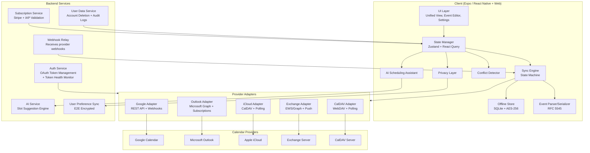
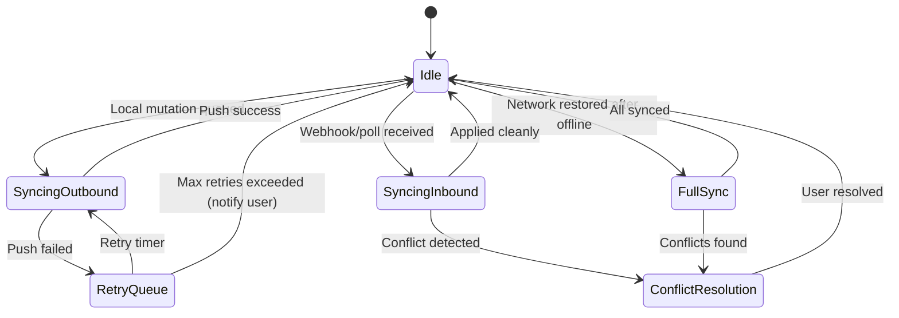

# Design Document: Unified Calendar App

## Overview

The Unified Calendar App is a cross-platform calendar aggregation application that connects to multiple calendar providers (Google Calendar, Microsoft Outlook, Apple iCloud, Exchange, CalDAV) and presents a single, unified view with full read-write capabilities. The application follows an offline-first architecture with bidirectional sync, AI-powered scheduling, granular privacy controls, and a freemium monetization model.

### Key Design Decisions

1. **Expo (React Native + React Native Web)**: Single codebase for iOS, Android, and PWA using Expo as the build and configuration layer. Expo handles webpack aliasing, babel config, platform-specific file resolution (`.web.js`, `.ios.js`, `.android.js`), and React Native Web integration automatically. This maximizes code reuse across all 6 target platforms while minimizing build tooling complexity. Use `Platform.OS` checks for minor platform differences and platform-specific file extensions for significant divergences (e.g., secure storage, SQLite drivers, push notification handlers).

2. **Offline-First with CRDT-inspired Sync**: The local SQLite database is the source of truth. All mutations happen locally first, then sync to providers. This ensures sub-200ms UI responsiveness and full offline capability.

3. **Provider Adapter Pattern**: Each calendar provider (Google, Outlook, iCloud, Exchange, CalDAV) is abstracted behind a common `CalendarProviderAdapter` interface, isolating provider-specific API differences from core business logic.

4. **Custom iCalendar Parser/Serializer**: A purpose-built RFC 5545 parser and serializer ensures round-trip fidelity, including preservation of unknown/opaque fields. Libraries like `ical.js` and `node-ical` exist but lack full round-trip guarantees and opaque field preservation required by Requirement 12.

5. **Event-Driven Sync Engine**: The sync engine operates as a state machine consuming local mutations, remote change notifications (webhooks), and polling results. It produces API calls, local writes, and conflict resolution prompts.

6. **Stripe + Platform IAP**: Payment processing uses Apple App Store and Google Play Store in-app purchases on mobile (required by platform policies) and Stripe for web/PWA subscriptions.

7. **Zustand Middleware Stack**: State management uses Zustand with `persist` middleware (backed by SQLite via custom storage adapter) for offline state persistence, `immer` middleware for deeply nested event/calendar state updates, and `devtools` middleware in development (disabled in production). The SyncEngine and background workers use `zustand/vanilla` stores since they operate outside the React component lifecycle.

8. **PKCE for Mobile OAuth2**: All mobile OAuth2 flows use PKCE (Proof of Key Code Exchange) to prevent authorization code interception via deep link hijacking. The `OAuthConfig` includes `codeVerifier` and `codeChallenge` parameters.

9. **Platform-Specific File Strategy**: Components with significant platform differences use file extensions (`.web.js`, `.ios.js`, `.android.js`). Key platform-specific modules include: secure storage (iOS Keychain / Android Keystore / Web Crypto), SQLite driver (`op-sqlite` on mobile / `sql.js` on web), push notification handlers, and biometric authentication.

### Technology Stack

| Layer | Technology |
|-------|-----------|
| Mobile (iOS/Android) | React Native 0.76+ via Expo |
| Web (PWA) | Expo Web (React Native Web under the hood) |
| State Management | Zustand (persist, immer, devtools middleware) + React Query |
| Local Database | SQLite (via `op-sqlite` on mobile, `sql.js` on web) |
| Encryption | AES-256-GCM (via platform crypto APIs) |
| Networking | Axios + WebSocket for push |
| iCalendar | Custom parser/serializer (TypeScript) |
| AI/ML | On-device TensorFlow Lite for pattern learning, server-side LLM for slot suggestions |
| Testing | Jest + fast-check (property-based testing) |
| CI/CD | GitHub Actions, EAS Build (mobile), Vercel (PWA) |

## Architecture

### High-Level Architecture



### Sync Engine State Machine



### Data Flow

1. **User creates/edits event** → Local SQLite write → UI updates immediately → Sync Engine queues outbound push → Provider Adapter sends to provider API
2. **Provider webhook fires** → Backend Webhook Relay → Push notification to client → Sync Engine fetches delta → Event Parser converts ICS → Local SQLite write → UI updates
3. **Offline mutation** → Local SQLite write with `pendingSync` flag → On reconnect, Sync Engine processes queue → Conflict detection if remote changed

## Components and Interfaces

### CalendarProviderAdapter Interface

```typescript
interface CalendarProviderAdapter {
  readonly providerId: ProviderId;
  
  // Authentication (PKCE required for mobile OAuth2 flows)
  authenticate(config: OAuthConfig): Promise<AuthResult>;
  refreshToken(token: RefreshToken): Promise<AuthResult>;
  revokeAccess(accountId: string): Promise<void>;
  
  // Calendar operations
  listCalendars(accountId: string): Promise<Calendar[]>;
  
  // Event operations
  listEvents(calendarId: string, range: DateRange): Promise<RawEventData[]>;
  createEvent(calendarId: string, event: RawEventData): Promise<string>; // returns provider event ID
  updateEvent(calendarId: string, eventId: string, event: RawEventData): Promise<void>;
  deleteEvent(calendarId: string, eventId: string): Promise<void>;
  
  // Sync
  getChanges(calendarId: string, syncToken: string | null): Promise<ChangeSet>;
  setupPushNotification?(calendarId: string, webhookUrl: string): Promise<PushSubscription>;
  
  // Free/busy
  getFreeBusy?(calendarId: string, range: DateRange): Promise<FreeBusySlot[]>;
}
```

### EventParser and EventSerializer

```typescript
interface EventParser {
  parse(icsData: string): ParseResult<CalendarEvent>;
  parseComponent(component: string): ParseResult<VEvent>;
}

interface EventSerializer {
  serialize(event: CalendarEvent): string;
  serializeComponent(vevent: VEvent): string;
}

interface ParseResult<T> {
  success: boolean;
  value?: T;
  error?: ParseError;
}

interface ParseError {
  line: number;
  message: string;
  raw: string;
}
```

### SyncEngine

```typescript
interface SyncEngine {
  // Lifecycle
  start(): void;
  stop(): void;
  
  // Outbound sync
  queueLocalChange(change: LocalChange): void;
  processOutboundQueue(): Promise<SyncResult>;
  
  // Inbound sync
  handleWebhookNotification(notification: WebhookPayload): Promise<void>;
  pollProvider(accountId: string): Promise<ChangeSet>;
  
  // Polling configuration
  // Providers without push support (e.g., CalDAV) are polled at intervals ≤ 5 minutes
  readonly pollingIntervalMs: number; // default: 300000 (5 minutes)
  
  // Conflict resolution
  getConflicts(): Conflict[];
  resolveConflict(conflictId: string, resolution: ConflictResolution): Promise<void>;
  
  // Full sync
  fullSync(accountId: string): Promise<SyncResult>;
  syncAllPending(): Promise<SyncResult>;
}
```

### PrivacyLayer

```typescript
interface PrivacyLayer {
  getVisibility(calendarId: string): VisibilityLevel;
  setVisibility(calendarId: string, level: VisibilityLevel): void;
  getEventOverride(eventId: string): VisibilityLevel | null;
  setEventOverride(eventId: string, level: VisibilityLevel): void;
  
  filterForAudience(events: CalendarEvent[], audience: Audience): CalendarEvent[];
}

type VisibilityLevel = 'public' | 'busy-only' | 'private';

interface Audience {
  type: 'owner' | 'delegate' | 'shared-view-member';
  userId: string;
  permissionLevel: 'read-only' | 'read-write';
}
```

### ConflictDetector

```typescript
interface ConflictDetector {
  // Reactive: check on event create/move
  detectConflicts(event: CalendarEvent, allEvents: CalendarEvent[]): Conflict[];
  suggestAlternatives(event: CalendarEvent, allEvents: CalendarEvent[], count: number): TimeSlot[];
  estimateTravelTime?(from: Location, to: Location): Promise<Duration>;
  
  // Continuous background scanning (Pro/Team tier only)
  // Runs after each inbound sync to detect new conflicts from provider changes
  startContinuousScanning(allEvents: CalendarEvent[]): void;
  stopContinuousScanning(): void;
  onConflictDetected: (conflict: Conflict) => void; // callback for push notifications
}

interface Conflict {
  id: string;
  eventA: CalendarEvent;
  eventB: CalendarEvent;
  overlapMinutes: number;
  travelTimeConflict: boolean;
}
```

### AISchedulingAssistant

```typescript
interface AISchedulingAssistant {
  suggestSlots(
    request: MeetingRequest,
    calendars: CalendarEvent[],
    preferences: SchedulingPreferences
  ): Promise<SlotSuggestion[]>;
  
  learnFromPattern(event: CalendarEvent, action: 'accepted' | 'declined' | 'rescheduled'): void;
  
  getPreferences(userId: string): SchedulingPreferences;
}

interface SlotSuggestion {
  start: Date;
  end: Date;
  score: number; // 0-1 confidence
  tradeoffs: string[]; // explanations if outside preferences
}
```

### SubscriptionManager

```typescript
interface SubscriptionManager {
  getCurrentTier(userId: string): SubscriptionTier;
  validateReceipt(receipt: PlatformReceipt): Promise<SubscriptionValidation>;
  checkFeatureAccess(userId: string, feature: Feature): boolean;
  handleDowngrade(userId: string, newTier: SubscriptionTier): Promise<void>;
  getGracePeriodEnd(userId: string): Date | null;
}

type SubscriptionTier = 'free' | 'pro' | 'team';
type Feature = 'unlimited_accounts' | 'ai_assistant' | 'conflict_detection' | 'advanced_privacy' | 'shared_views' | 'delegation';
```

### TokenHealthMonitor

```typescript
interface TokenHealthMonitor {
  // Proactive token validity checking (Req 1 AC 4: detect revocation within 30s)
  startMonitoring(accounts: CalendarAccount[]): void;
  stopMonitoring(): void;
  
  // Checks token validity by making a lightweight API call to each provider
  // Runs on a 30-second interval for active accounts
  checkTokenHealth(accountId: string): Promise<TokenHealthStatus>;
  
  onTokenRevoked: (accountId: string) => void; // triggers re-auth prompt
}

type TokenHealthStatus = 'valid' | 'expired' | 'revoked' | 'unknown';
```

### UserPreferenceSyncService

```typescript
interface UserPreferenceSyncService {
  // E2E encrypted sync of privacy preferences across user's devices (Req 5 AC 6)
  // Uses a per-user encryption key derived from user credentials
  syncPreferences(userId: string): Promise<void>;
  pushPreferences(userId: string, preferences: EncryptedPreferences): Promise<void>;
  pullPreferences(userId: string): Promise<EncryptedPreferences>;
  
  // Key management
  deriveEncryptionKey(userCredentials: UserCredentials): Promise<CryptoKey>;
}

interface EncryptedPreferences {
  ciphertext: ArrayBuffer;
  iv: ArrayBuffer;
  version: number;
  updatedAt: Date;
}
```

### UserDataService

```typescript
interface UserDataService {
  // Server-side user data management (Req 13 AC 4: delete within 30 days)
  deleteUserAccount(userId: string): Promise<DeletionReceipt>;
  getDeletionStatus(userId: string): Promise<DeletionStatus>;
  
  // Auth event logging (Req 13 AC 6: session activity view)
  logAuthEvent(event: AuthEvent): Promise<void>;
  getAuthEvents(userId: string, limit: number): Promise<AuthEvent[]>;
}

interface AuthEvent {
  id: string;
  userId: string;
  eventType: 'login' | 'logout' | 'token_refresh' | 'token_revoked' | 'password_change';
  platform: 'ios' | 'android' | 'web';
  ipAddress: string;
  userAgent: string;
  timestamp: Date;
}

interface DeletionReceipt {
  userId: string;
  requestedAt: Date;
  scheduledCompletionAt: Date; // requestedAt + 30 days
  status: 'pending' | 'in_progress' | 'completed';
}
```

### OnboardingManager

```typescript
interface OnboardingManager {
  // Guided onboarding flow (Req 11: max 4 steps, first account in 60s)
  getOnboardingState(userId: string): OnboardingState;
  completeStep(userId: string, step: OnboardingStep): void;
  skipOnboarding(userId: string): void;
  resetOnboarding(userId: string): void; // accessible from settings
  
  // Contextual tooltips (Req 11 AC 4: first 7 days)
  shouldShowTooltip(userId: string, feature: string): boolean;
  dismissTooltip(userId: string, feature: string): void;
}

interface OnboardingState {
  currentStep: OnboardingStep;
  completedSteps: OnboardingStep[];
  skipped: boolean;
  firstOpenedAt: Date;
  tooltipsDismissed: string[];
}

type OnboardingStep = 'welcome' | 'connect_first_account' | 'choose_view' | 'explore_features';
```

### Internationalization (i18n)

```typescript
interface I18nService {
  // Supports 10 required languages (Req 11 AC 6)
  readonly supportedLocales: readonly [
    'en', 'es', 'fr', 'de', 'ja', 'ko', 'zh-CN', 'pt', 'it', 'ar'
  ];
  
  getCurrentLocale(): string;
  setLocale(locale: string): void;
  t(key: string, params?: Record<string, string | number>): string;
  
  // RTL support for Arabic
  isRTL(): boolean;
}
```

### Responsive Layout

```typescript
// Responsive breakpoint system (Req 9 AC 5: 320px to 2560px)
interface ResponsiveLayout {
  readonly breakpoints: {
    phone: 320;      // 320-767px: single column, bottom nav
    tablet: 768;     // 768-1023px: sidebar + main, collapsible nav
    desktop: 1024;   // 1024-1439px: sidebar + main + detail panel
    wide: 1440;      // 1440-2560px: full three-column layout
  };
  
  getCurrentBreakpoint(): 'phone' | 'tablet' | 'desktop' | 'wide';
  useBreakpoint(): 'phone' | 'tablet' | 'desktop' | 'wide'; // React hook
}

// Unified View adapts per breakpoint:
// - phone: agenda/day view default, swipe between days, bottom tab nav
// - tablet: week view default, collapsible sidebar with calendar list
// - desktop: week/month view default, persistent sidebar, event detail panel
// - wide: month view default, full three-column (calendars | timeline | event detail)
```

### Accessibility

```typescript
// Accessibility compliance (Req 9 AC 6)
// iOS: VoiceOver, Android: TalkBack, Web: WCAG 2.1 AA
interface AccessibilityConfig {
  // All interactive elements must have accessible labels
  // Calendar events must announce: title, time, calendar name, conflict status
  // Color coding must meet WCAG 2.1 AA contrast ratio (4.5:1 for text, 3:1 for UI)
  // Calendar colors are paired with patterns/icons for color-blind users
  // Navigation must be fully keyboard-accessible on web
  // Screen reader announcements for: view changes, sync status, conflict alerts
  // Focus management: trap focus in modals, return focus on dismiss
  // Reduced motion: respect prefers-reduced-motion for animations
  
  readonly minContrastRatio: 4.5;
  readonly minUIContrastRatio: 3.0;
  announceToScreenReader(message: string, priority: 'polite' | 'assertive'): void;
}
```

## Data Models

### Core Entities

```typescript
interface CalendarAccount {
  id: string;                    // UUID
  userId: string;
  providerId: ProviderId;
  displayName: string;
  email: string;
  color: string;                 // hex color for UI
  visibility: VisibilityLevel;
  syncToken: string | null;      // provider-specific sync cursor
  lastSyncedAt: Date | null;
  status: 'active' | 'revoked' | 'error';
  createdAt: Date;
}

type ProviderId = 'google' | 'outlook' | 'icloud' | 'exchange' | 'caldav';

interface CalendarEvent {
  id: string;                    // local UUID
  providerEventId: string;       // provider's event ID
  calendarAccountId: string;
  title: string;
  description: string | null;
  location: string | null;
  startTime: Date;               // stored as UTC
  endTime: Date;                 // stored as UTC
  timeZone: string;              // IANA timezone for display
  isAllDay: boolean;
  recurrenceRule: RecurrenceRule | null;
  recurrenceExceptionDate: Date | null; // if this is an exception instance
  parentRecurringEventId: string | null;
  organizer: Organizer | null;   // RFC 5545 ORGANIZER (required for group-scheduled events)
  attendees: Attendee[];
  sequence: number;              // RFC 5545 SEQUENCE for change management (starts at 0)
  dtstamp: Date;                 // RFC 5545 DTSTAMP (required, stored as UTC)
  status: 'confirmed' | 'tentative' | 'cancelled';
  visibility: VisibilityLevel | null; // per-event override
  opaqueFields: Map<string, string>;  // preserved unknown ICS fields
  syncStatus: 'synced' | 'pending_create' | 'pending_update' | 'pending_delete' | 'conflict';
  localVersion: number;          // optimistic concurrency
  remoteEtag: string | null;     // provider's version tag
  modifiedBy: string | null;     // delegate ID if modified by delegate
  createdAt: Date;
  updatedAt: Date;
}

interface Organizer {
  email: string;                 // mailto: URI
  displayName: string | null;
  sentBy: string | null;         // acting on behalf of
}

interface RecurrenceRule {
  frequency: 'daily' | 'weekly' | 'monthly' | 'yearly';
  interval: number;
  count: number | null;
  until: Date | null;
  bySecond: number[] | null;     // 0-60
  byMinute: number[] | null;     // 0-59
  byHour: number[] | null;       // 0-23
  byDay: string[] | null;        // e.g., ['MO', 'WE', 'FR'] or ['+1MO', '-1FR']
  byMonthDay: number[] | null;   // 1-31 or -31 to -1
  byYearDay: number[] | null;    // 1-366 or -366 to -1
  byWeekNo: number[] | null;     // 1-53 or -53 to -1
  byMonth: number[] | null;      // 1-12
  bySetPos: number[] | null;     // 1-366 or -366 to -1
  wkst: string;                  // Week start day: 'MO' (default), 'SU', etc.
  exceptions: Date[];            // EXDATE values
}

interface Attendee {
  email: string;
  displayName: string | null;
  status: 'accepted' | 'declined' | 'tentative' | 'needs-action';
  role: 'required' | 'optional' | 'chair';
}

interface SyncQueueEntry {
  id: string;
  calendarAccountId: string;
  eventId: string;
  operation: 'create' | 'update' | 'delete';
  payload: string;               // serialized event data
  retryCount: number;
  maxRetries: number;
  nextRetryAt: Date;
  status: 'pending' | 'in_progress' | 'failed' | 'completed';
  createdAt: Date;
}

interface UserSubscription {
  userId: string;
  tier: SubscriptionTier;
  platform: 'app_store' | 'play_store' | 'stripe';
  receiptId: string;
  expiresAt: Date;
  gracePeriodEndsAt: Date | null;
  autoRenew: boolean;
  connectedAccountCount: number;
}

interface SharedCalendarView {
  id: string;
  ownerId: string;
  name: string;
  calendarIds: string[];
  members: SharedViewMember[];
  maxMembers: number;            // 20 for Team tier
  createdAt: Date;
}

interface SharedViewMember {
  userId: string;
  permission: 'read-only' | 'read-write';
  addedAt: Date;
}

interface DelegationGrant {
  id: string;
  delegatorId: string;
  delegateId: string;
  calendarIds: string[];
  permission: 'read-only' | 'read-write';
  grantedAt: Date;
  revokedAt: Date | null;
}

interface SchedulingPreferences {
  userId: string;
  preferredStartHour: number;    // 0-23
  preferredEndHour: number;
  minimumBufferMinutes: number;
  maxMeetingsPerDay: number;
  focusTimeBlocks: TimeBlock[];
  learnedPatterns: LearnedPattern[];
}

interface LearnedPattern {
  dayOfWeek: number;
  hourSlot: number;
  acceptanceRate: number;        // 0-1
  averageDuration: number;       // minutes
  sampleCount: number;
}
```

### SQLite Schema (Local)

```sql
CREATE TABLE calendar_accounts (
  id TEXT PRIMARY KEY,
  user_id TEXT NOT NULL,
  provider_id TEXT NOT NULL,
  display_name TEXT NOT NULL,
  email TEXT NOT NULL,
  color TEXT NOT NULL,
  visibility TEXT NOT NULL DEFAULT 'public',
  sync_token TEXT,
  last_synced_at INTEGER,
  status TEXT NOT NULL DEFAULT 'active',
  created_at INTEGER NOT NULL
);

CREATE TABLE events (
  id TEXT PRIMARY KEY,
  provider_event_id TEXT,
  calendar_account_id TEXT NOT NULL REFERENCES calendar_accounts(id) ON DELETE CASCADE,
  title TEXT NOT NULL,
  description TEXT,
  location TEXT,
  start_time INTEGER NOT NULL,
  end_time INTEGER NOT NULL,
  time_zone TEXT NOT NULL,
  is_all_day INTEGER NOT NULL DEFAULT 0,
  recurrence_rule TEXT,
  recurrence_exception_date INTEGER,
  parent_recurring_event_id TEXT,
  organizer TEXT,
  attendees TEXT,
  sequence INTEGER NOT NULL DEFAULT 0,
  dtstamp INTEGER NOT NULL,
  status TEXT NOT NULL DEFAULT 'confirmed',
  visibility_override TEXT,
  opaque_fields TEXT,
  sync_status TEXT NOT NULL DEFAULT 'synced',
  local_version INTEGER NOT NULL DEFAULT 1,
  remote_etag TEXT,
  modified_by TEXT,
  created_at INTEGER NOT NULL,
  updated_at INTEGER NOT NULL
);

CREATE INDEX idx_events_calendar ON events(calendar_account_id);
CREATE INDEX idx_events_time ON events(start_time, end_time);
CREATE INDEX idx_events_sync ON events(sync_status);
CREATE INDEX idx_events_provider_id ON events(provider_event_id);

CREATE TABLE sync_queue (
  id TEXT PRIMARY KEY,
  calendar_account_id TEXT NOT NULL REFERENCES calendar_accounts(id) ON DELETE CASCADE,
  event_id TEXT NOT NULL REFERENCES events(id) ON DELETE CASCADE,
  operation TEXT NOT NULL,
  payload TEXT NOT NULL,
  retry_count INTEGER NOT NULL DEFAULT 0,
  max_retries INTEGER NOT NULL DEFAULT 5,
  next_retry_at INTEGER NOT NULL,
  status TEXT NOT NULL DEFAULT 'pending',
  created_at INTEGER NOT NULL
);

CREATE TABLE user_subscription (
  user_id TEXT PRIMARY KEY,
  tier TEXT NOT NULL DEFAULT 'free',
  platform TEXT NOT NULL,
  receipt_id TEXT,
  expires_at INTEGER,
  grace_period_ends_at INTEGER,
  auto_renew INTEGER NOT NULL DEFAULT 1,
  connected_account_count INTEGER NOT NULL DEFAULT 0
);

CREATE TABLE privacy_preferences (
  calendar_id TEXT PRIMARY KEY REFERENCES calendar_accounts(id) ON DELETE CASCADE,
  visibility TEXT NOT NULL DEFAULT 'public'
);

CREATE TABLE event_visibility_overrides (
  event_id TEXT PRIMARY KEY REFERENCES events(id) ON DELETE CASCADE,
  visibility TEXT NOT NULL
);

CREATE TABLE scheduling_preferences (
  user_id TEXT PRIMARY KEY,
  preferred_start_hour INTEGER NOT NULL DEFAULT 9,
  preferred_end_hour INTEGER NOT NULL DEFAULT 17,
  minimum_buffer_minutes INTEGER NOT NULL DEFAULT 15,
  max_meetings_per_day INTEGER NOT NULL DEFAULT 8,
  focus_time_blocks TEXT,
  learned_patterns TEXT
);

CREATE TABLE auth_events (
  id TEXT PRIMARY KEY,
  user_id TEXT NOT NULL,
  event_type TEXT NOT NULL,
  platform TEXT NOT NULL,
  ip_address TEXT,
  user_agent TEXT,
  timestamp INTEGER NOT NULL
);

CREATE INDEX idx_auth_events_user ON auth_events(user_id, timestamp);

CREATE TABLE onboarding_state (
  user_id TEXT PRIMARY KEY,
  current_step TEXT NOT NULL DEFAULT 'welcome',
  completed_steps TEXT NOT NULL DEFAULT '[]',
  skipped INTEGER NOT NULL DEFAULT 0,
  first_opened_at INTEGER NOT NULL,
  tooltips_dismissed TEXT NOT NULL DEFAULT '[]'
);
```

### Server-Side Data Model

The backend stores minimal user data. The following is managed server-side:

| Table | Purpose | Deletion Policy |
|-------|---------|----------------|
| `users` | User ID, email, created_at | Deleted immediately on account deletion request |
| `subscriptions` | Tier, platform, receipt, expiry | Deleted with user |
| `auth_events` | Login/logout/token events for session activity view | Deleted with user, retained max 90 days |
| `encrypted_preferences` | E2E encrypted privacy preferences blob | Deleted with user, server cannot decrypt |
| `deletion_requests` | Tracks account deletion progress | Retained until deletion completes (max 30 days) |
| `shared_views` | Shared calendar view membership | Deleted with user, members notified |
| `delegation_grants` | Delegation permissions | Revoked and deleted with user |

Account deletion process: User requests deletion → local data erased immediately → server marks account for deletion → background job purges all server-side records within 30 days → deletion receipt issued.
```

### Backend API Contracts

All backend endpoints use HTTPS (TLS 1.2+), JSON request/response bodies, and JWT bearer token authentication.

#### Auth Service

```
POST   /auth/token/refresh     { accountId, refreshToken } → { accessToken, expiresIn }
POST   /auth/token/revoke      { accountId } → { success }
GET    /auth/token/health/:id  → { status: 'valid' | 'expired' | 'revoked' }
GET    /auth/events            → AuthEvent[]  (paginated, last 90 days)
```

#### Webhook Relay

```
POST   /webhooks/google        (Google push notification payload) → 200 OK
POST   /webhooks/microsoft     (Microsoft Graph notification payload) → 200 OK
POST   /ws/connect             WebSocket upgrade → bidirectional push channel
```

Client subscribes via WebSocket message: `{ type: 'subscribe', userId, deviceId }`
Server pushes: `{ type: 'event_changed', accountId, changeType, syncToken }`

#### Subscription Service

```
POST   /subscriptions/validate   { platform, receiptId } → { tier, expiresAt, gracePeriodEndsAt }
GET    /subscriptions/:userId    → { tier, expiresAt, autoRenew, gracePeriodEndsAt }
POST   /subscriptions/webhook    (RevenueCat / Stripe webhook payload) → 200 OK
```

#### AI Service

```
POST   /ai/suggest-slots   { userId, duration, attendeeEmails?, dateRange, preferences } → SlotSuggestion[]
```

Request body does NOT include event titles or descriptions — only anonymized availability windows.

#### User Preference Sync Service

```
PUT    /preferences/:userId   { ciphertext, iv, version } → { success }
GET    /preferences/:userId   → { ciphertext, iv, version, updatedAt }
```

Server stores opaque encrypted blob. Cannot decrypt. Client derives key from user credentials.

#### User Data Service

```
DELETE /users/:userId          → { deletionReceipt: { requestedAt, scheduledCompletionAt, status } }
GET    /users/:userId/deletion → { status: 'pending' | 'in_progress' | 'completed' }
```

#### Rate Limiting (all endpoints)

```
X-RateLimit-Limit: 100
X-RateLimit-Remaining: 95
X-RateLimit-Reset: 1620000000
```

429 responses include `Retry-After` header.

## Correctness Properties

*A property is a characteristic or behavior that should hold true across all valid executions of a system — essentially, a formal statement about what the system should do. Properties serve as the bridge between human-readable specifications and machine-verifiable correctness guarantees.*

### Property 1: Event serialization round-trip

*For any* valid `CalendarEvent` object, serializing it to iCalendar format via `EventSerializer` and then parsing the result via `EventParser` SHALL produce a `CalendarEvent` equivalent to the original (with all fields matching: title, description, location, start/end times, recurrence rules, attendees, and status).

**Validates: Requirements 12.1, 12.2, 12.5**

### Property 2: Opaque field preservation through round-trip

*For any* iCalendar data containing fields not recognized by the parser, parsing then serializing SHALL produce output that contains all original unrecognized fields with their values intact.

**Validates: Requirements 12.3**

### Property 3: Malformed iCalendar error reporting

*For any* malformed iCalendar input string, the `EventParser` SHALL return a `ParseError` with a `line` number greater than 0 and a non-empty `message` string.

**Validates: Requirements 12.4**

### Property 4: Timezone normalization to UTC

*For any* valid iCalendar event with a VTIMEZONE component specifying any valid IANA timezone, parsing SHALL produce a `CalendarEvent` with `startTime` and `endTime` stored as UTC values that represent the same instant as the original timezone-local times.

**Validates: Requirements 12.6**

### Property 5: Privacy filtering enforces visibility rules

*For any* set of calendar events and any non-owner audience, the `PrivacyLayer.filterForAudience` function SHALL:
- Return zero events from calendars set to `private` visibility
- Return events from `busy-only` calendars with `title`, `description`, and `attendees` stripped (only time blocks preserved)
- Return full event details from `public` calendars

**Validates: Requirements 5.2, 5.3, 5.5**

### Property 6: Per-event visibility override takes precedence

*For any* event with a visibility override set, the effective visibility used by `PrivacyLayer.filterForAudience` SHALL equal the event-level override, regardless of the calendar-level visibility setting.

**Validates: Requirements 5.4**

### Property 7: Conflict detection correctness

*For any* two `CalendarEvent` objects, the `ConflictDetector` SHALL report a time overlap conflict if and only if `startA < endB AND startB < endA` (where A and B are the two events).

**Validates: Requirements 7.1**

### Property 8: Alternative slot suggestions are conflict-free

*For any* time slot suggested by `ConflictDetector.suggestAlternatives`, that slot SHALL not overlap with any existing event across all visible calendars.

**Validates: Requirements 7.3**

### Property 9: Travel time conflict detection

*For any* two consecutive events with different physical locations, if the time gap between `endA` and `startB` is less than the estimated travel time between the two locations, the `ConflictDetector` SHALL report a travel-time conflict.

**Validates: Requirements 7.4**

### Property 10: Subscription tier feature access enforcement

*For any* user and any feature, `SubscriptionManager.checkFeatureAccess` SHALL return `true` if and only if the user's current tier includes that feature (Free: basic view only; Pro: unlimited accounts, AI, conflict detection, advanced privacy; Team: all Pro features plus shared views and delegation).

**Validates: Requirements 1.3, 10.1, 10.2, 10.3**

### Property 11: Downgrade retains data but disables features

*For any* user downgrading from a higher tier to a lower tier, all existing event data and calendar accounts SHALL be retained, but `checkFeatureAccess` SHALL return `false` for features not included in the new tier.

**Validates: Requirements 10.4**

### Property 12: Grace period calculation

*For any* subscription payment failure date, features SHALL remain accessible for exactly 7 days after the failure. After the grace period, `checkFeatureAccess` SHALL enforce Free tier limits.

**Validates: Requirements 10.6**

### Property 13: Recurring event exception isolation

*For any* recurring event and any single instance modification (creating an exception), all other occurrences of the recurring event SHALL remain identical to their state before the modification.

**Validates: Requirements 3.5**

### Property 14: Recurrence rule expansion correctness

*For any* valid `RecurrenceRule`, expanding the rule SHALL produce dates that all satisfy the rule's constraints (correct frequency, interval, day-of-week, month, etc.) and the count of generated dates SHALL not exceed the rule's `count` or extend past the rule's `until` date.

**Validates: Requirements 3.4**

### Property 15: Failed write operations are queued

*For any* write operation (create, update, delete) that fails when pushing to a `CalendarProviderAdapter`, the `SyncEngine` SHALL create exactly one `SyncQueueEntry` with `status: 'pending'`, `retryCount: 0`, and the correct `operation` type.

**Validates: Requirements 3.6**

### Property 16: Sync conflict detection preserves both versions

*For any* event that has been modified both locally (in the `OfflineStore`) and remotely (on the `CalendarProvider`) with different content, the `SyncEngine` SHALL produce a `Conflict` object containing both the local and remote versions of the event.

**Validates: Requirements 4.5, 6.5**

### Property 17: Unified view contains all events

*For any* set of connected calendar accounts with events, the unified view model SHALL contain exactly the union of all events from all accounts (where each account's calendar visibility is toggled on).

**Validates: Requirements 2.1**

### Property 18: Overlapping event layout assigns visible positions

*For any* set of time-overlapping events, the layout algorithm SHALL assign each event a distinct column position such that all events are visually represented (no event is hidden or truncated).

**Validates: Requirements 2.5**

### Property 19: Offline CRUD operations and sync queue consistency

*For any* valid event CRUD operation performed while offline, the local store SHALL reflect the change immediately, and the sync queue SHALL contain exactly one corresponding entry with the correct operation type.

**Validates: Requirements 6.1, 6.2**

### Property 20: Data removal completeness

*For any* calendar account removal or user account deletion, the local store SHALL contain zero records (events, sync queue entries, privacy preferences) associated with the removed account/user after the operation completes.

**Validates: Requirements 1.6, 13.4**

### Property 21: Delegation permission enforcement

*For any* delegation grant, if the permission is `read-write`, the delegate SHALL be able to create, update, and delete events. If the permission is `read-only`, all write operations by the delegate SHALL be rejected. After revocation, all operations (read and write) by the former delegate SHALL be rejected.

**Validates: Requirements 14.2, 14.3, 14.5**

### Property 22: Delegate modification audit trail

*For any* event modified by a delegate, the event's `modifiedBy` field SHALL contain the delegate's user ID.

**Validates: Requirements 14.4**

### Property 23: Shared view member limit enforcement

*For any* shared calendar view on the Team tier, attempting to add a member when the view already has 20 members SHALL be rejected.

**Validates: Requirements 14.6**

### Property 24: AI scheduling suggestions respect preferences

*For any* set of scheduling preferences and any slot suggested by `AISchedulingAssistant.suggestSlots`, the slot SHALL fall within the user's preferred meeting hours, maintain at least the minimum buffer time from adjacent events, and not cause the day's meeting count to exceed the maximum.

**Validates: Requirements 8.5**

### Property 25: AI scheduling suggestions are conflict-free

*For any* calendar state and meeting request, all time slots returned by `AISchedulingAssistant.suggestSlots` SHALL be free across all connected calendars (no overlap with existing events), and the number of suggestions SHALL be at most 3.

**Validates: Requirements 8.2**

### Property 26: Token revocation detection within 30 seconds

*For any* calendar account whose OAuth token has been revoked by the provider, the `TokenHealthMonitor` SHALL detect the revocation and invoke `onTokenRevoked` within 30 seconds of the revocation occurring.

**Validates: Requirements 1.4**

### Property 27: Onboarding flow never exceeds 4 steps

*For any* valid `OnboardingState`, the total number of steps in the onboarding flow (from `welcome` to completion) SHALL be exactly 4. The `completedSteps` array SHALL never contain more than 4 entries.

**Validates: Requirements 11.1**

### Property 28: Continuous conflict scanning detects new conflicts within 60 seconds

*For any* newly synced event from a `CalendarProvider` that overlaps with an existing event, the `ConflictDetector.onConflictDetected` callback SHALL fire within 60 seconds of the sync completing.

**Validates: Requirements 7.6**

### Property 29: E2E encrypted preference round-trip

*For any* set of privacy preferences, encrypting via `UserPreferenceSyncService.pushPreferences` and then decrypting via `pullPreferences` with the same user's derived encryption key SHALL produce preferences identical to the original.

**Validates: Requirements 5.6**

### Property 30: Server-side data deletion completeness

*For any* user account deletion request, the `UserDataService.deleteUserAccount` SHALL return a `DeletionReceipt` with `scheduledCompletionAt` no more than 30 days after `requestedAt`, and after completion, all server-side tables SHALL contain zero records for that user.

**Validates: Requirements 13.4**

### Property 31: Auth event logging completeness

*For any* authentication action (login, logout, token refresh, token revocation, password change), the `UserDataService.logAuthEvent` SHALL create exactly one `AuthEvent` record with the correct `eventType`, `platform`, and `timestamp`.

**Validates: Requirements 13.6**

### Property 32: Polling interval compliance

*For any* calendar account connected to a provider without push notification support, the `SyncEngine` SHALL poll that provider at intervals no greater than `pollingIntervalMs` (default 300000ms / 5 minutes).

**Validates: Requirements 4.4**

## Error Handling

### Error Categories and Strategies

| Category | Examples | Strategy |
|----------|----------|----------|
| **Network Errors** | Timeout, DNS failure, connection refused | Retry with exponential backoff (max 5 retries). Queue for offline sync if persistent. |
| **Auth Errors** | Token expired, token revoked, invalid credentials | Auto-refresh token on 401. If refresh fails, mark account as `revoked` and notify user within 30s. |
| **Provider API Errors** | Rate limited (429), server error (5xx), quota exceeded | Respect `Retry-After` header. Exponential backoff for 5xx. Notify user for quota issues. |
| **Parse Errors** | Malformed ICS, invalid timezone, missing required fields | Return `ParseError` with line number and description. Skip malformed events during sync, log warning. |
| **Conflict Errors** | Concurrent modification, version mismatch | Present both versions to user. Never auto-resolve — user decides. |
| **Storage Errors** | SQLite full, encryption failure, corruption | Alert user. Attempt database recovery. Fall back to read-only mode if write fails. |
| **Payment Errors** | Card declined, receipt validation failure | 7-day grace period. Notify user via in-app banner and push notification. |
| **Sync Queue Overflow** | Too many pending changes | Cap queue at 1000 entries. Prioritize by recency. Alert user if queue is full. |

### Retry Policy

```typescript
interface RetryPolicy {
  maxRetries: number;        // 5
  initialDelayMs: number;    // 1000
  maxDelayMs: number;        // 60000
  backoffMultiplier: number; // 2
  jitterFactor: number;      // 0.1
}
```

All retryable operations use exponential backoff with jitter to avoid thundering herd on provider APIs.

### Graceful Degradation

- **No network**: Full offline mode. All CRUD operations work locally. Sync queue accumulates.
- **Provider down**: Events from that provider show stale data with a "last synced X ago" indicator. Other providers unaffected.
- **Auth revoked**: Calendar shows "reconnect required" badge. Events remain visible (cached) but read-only.
- **Subscription expired (grace period)**: All features remain active. Banner shows "payment issue" warning.
- **Subscription expired (past grace)**: Pro/Team features disabled. Data retained. Excess accounts become read-only.

## Testing Strategy

### Testing Approach

This project uses a dual testing approach combining unit tests with property-based tests for comprehensive coverage.

**Unit Tests (Jest)**:
- Specific examples demonstrating correct behavior for each component
- Integration points between components (e.g., SyncEngine ↔ ProviderAdapter)
- Edge cases: empty inputs, boundary values, error conditions
- UI component rendering tests (snapshot tests at key breakpoints)

**Property-Based Tests (fast-check)**:
- All 25 correctness properties defined above
- Each property test runs a minimum of 100 iterations
- Each test is tagged with: `Feature: unified-calendar-app, Property {N}: {title}`
- Generators produce random but valid `CalendarEvent`, `RecurrenceRule`, `CalendarAccount`, `SchedulingPreferences`, and iCalendar strings

**Integration Tests**:
- OAuth flow with mock provider endpoints
- Sync engine with mock provider adapters (webhook delivery, polling)
- Payment validation with mock App Store / Play Store / Stripe APIs
- Cross-platform sync timing verification
- Encryption at rest verification

**Smoke Tests**:
- All 5 provider adapters are registered and instantiable
- PWA manifest and service worker configured
- TLS configuration on all endpoints
- Translation files exist for all 10 required languages
- Build targets exist for iOS, Android, and PWA

### Property-Based Testing Configuration

- **Library**: [fast-check](https://github.com/dubzzz/fast-check) for TypeScript
- **Minimum iterations**: 100 per property
- **Seed**: Configurable for reproducibility
- **Arbitraries (generators)**:
  - `arbCalendarEvent()`: Generates valid `CalendarEvent` objects with random but valid fields
  - `arbRecurrenceRule()`: Generates valid `RecurrenceRule` with random frequency, interval, constraints
  - `arbIcsString()`: Generates valid iCalendar formatted strings with random events and optional unknown fields
  - `arbMalformedIcs()`: Generates syntactically invalid iCalendar strings
  - `arbVisibilityLevel()`: Generates one of `'public' | 'busy-only' | 'private'`
  - `arbSubscriptionTier()`: Generates one of `'free' | 'pro' | 'team'`
  - `arbSchedulingPreferences()`: Generates valid preference objects
  - `arbDelegationGrant()`: Generates delegation grants with random permissions
  - `arbTimeRange()`: Generates valid start/end time pairs

### Test Tag Format

Each property-based test must include a comment referencing its design property:

```typescript
// Feature: unified-calendar-app, Property 1: Event serialization round-trip
it('round-trips any valid CalendarEvent through serialize then parse', () => {
  fc.assert(
    fc.property(arbCalendarEvent(), (event) => {
      const ics = serializer.serialize(event);
      const result = parser.parse(ics);
      expect(result.success).toBe(true);
      expect(result.value).toEqual(event);
    }),
    { numRuns: 100 }
  );
});
```
